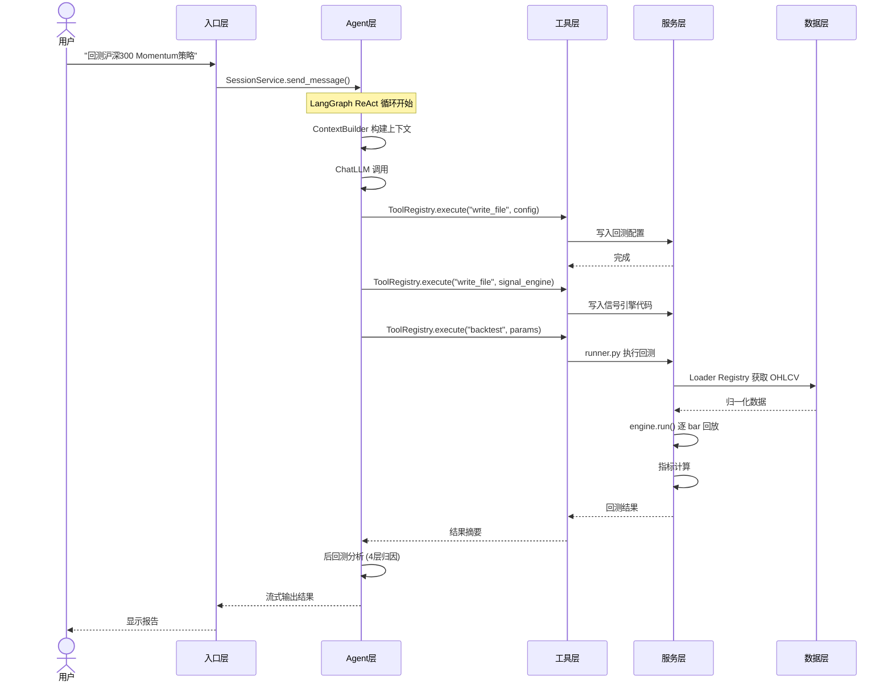
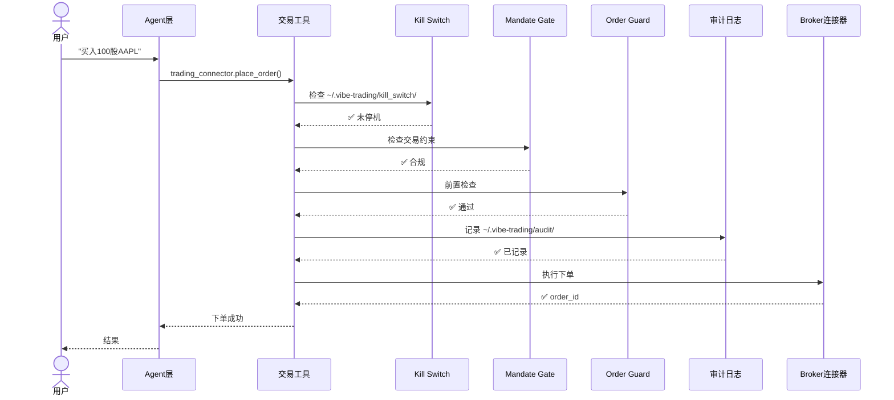
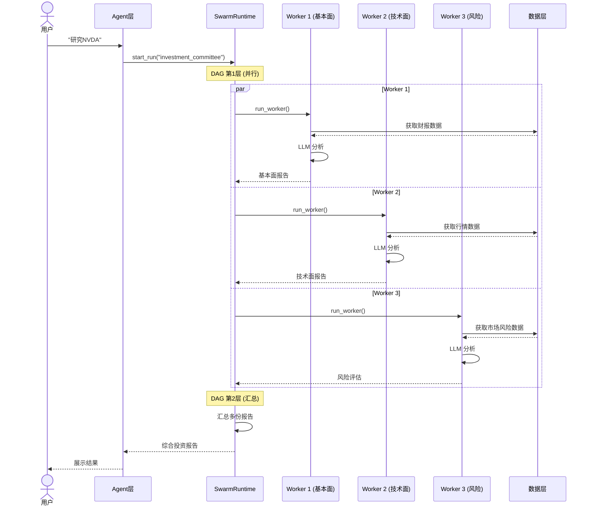

# Vibe-Trading 架构全景文档

> 版本：v0.1.10 | 更新日期：2026-07-07 | Main Agent 深度审查：v2

> **相关特性文档**：[miniqmt/xtquant 实盘集成方案](features/xtquant-integration.md)

---

## 目录

1. [项目概览](#1-项目概览)
2. [整体分层架构](#2-整体分层架构)
3. [入口层](#3-入口层)
4. [Agent 层](#4-agent-层)
5. [工具层](#5-工具层)
6. [服务层](#6-服务层)
7. [交易安全层](#7-交易安全层)
8. [回测引擎](#8-回测引擎)
9. [Alpha Zoo 因子库](#9-alpha-zoo-因子库)
10. [多 Agent Swarm](#10-多-agent-swarm)
11. [IM 频道系统](#11-im-频道系统)
12. [持久化层](#12-持久化层)
13. [LLM Provider 抽象层](#13-llm-provider-抽象层)
14. [Research Goal 系统](#14-research-goal-系统)
15. [Shadow Account](#15-shadow-account)
16. [前端架构](#16-前端架构)
17. [配置与数据目录](#17-配置与数据目录)
18. [数据流全景](#18-数据流全景)
19. [测试策略](#19-测试策略)
20. [架构约束与安全边界](#20-架构约束与安全边界)
21. [深度架构分析 — Main Agent 审查](#21-深度架构分析--main-agent-审查)
    - [21.1 架构质量评估](#211-架构质量评估)
    - [21.2 设计模式分析](#212-设计模式分析)
    - [21.3 数据流完整性](#213-数据流完整性)
    - [21.4 技术债务与风险](#214-技术债务与风险)
    - [21.5 模块依赖关系图](#215-模块依赖关系图)
    - [21.6 安全性深度评估](#216-安全性深度评估)
    - [21.7 可扩展性分析](#217-可扩展性分析)
    - [21.8 前端-后端交互分析](#218-前端-后端交互分析)
    - [21.9 关键发现优先级排序](#219-关键发现优先级排序)
22. [特性文档索引](features/) *(扩展功能独立文档)*

---

## 1. 项目概览

**Vibe-Trading**（亦名 `vibe-trading-ai`）是一个**自然语言驱动的金融研究 AI Agent 平台**，由香港大学（HKUDS）开发。用户通过自然语言即可完成量化回测、因子分析、市场研究、策略开发、投资组合管理等复杂金融任务。

| 项目 | 值 |
|---|---|
| 包名 | `vibe-trading-ai` |
| 当前版本 | v0.1.10 |
| Python | 3.11+ |
| 后框架 | FastAPI + LangGraph ReAct Agent |
| 前端框架 | React 19 + Vite + TypeScript + Tailwind CSS |
| 入口形式 | CLI / API Server / MCP Server |
| 协议 | Apache-2.0 |
| 组织 | HKU Data Science |

### 核心能力矩阵

| 能力 | 说明 |
|---|---|
| **量化回测** | 8 种市场引擎（A股、美股、港股、加密货币、期货、外汇、期权、跨市场） |
| **Alpha Zoo** | 456 个预构建量化因子，支持自定义 |
| **多 Agent Swarm** | 29 个预设团队，DAG 并行调度 |
| **交易执行** | 10+ 券商连接器，完整安全链路 |
| **IM 频道** | 16 种即时通讯渠道接入 |
| **Research Goal** | 分层风险管理的研究目标系统 |
| **Shadow Account** | 交易日志→策略提取→跨市场回测 |
| **记忆系统** | 跨会话持久化记忆 |
| **假设管理** | 研究假设的完整生命周期管理 |
| **数据层** | 18 种数据源，自动回退机制 |

---

## 2. 整体分层架构

Vibe-Trading 采用严格的**单向依赖分层架构**：

```
┌──────────────────────────────────────────────────────────────────┐
│                      Entry Layer（入口层）                        │
│                                                                  │
│   ┌──────────┐    ┌──────────────┐    ┌────────────────────┐    │
│   │ CLI      │    │ FastAPI      │    │ MCP Server         │    │
│   │ agent/   │    │ api_server   │    │ mcp_server.py      │    │
│   │ cli/     │    │ .py          │    │ (54 工具)           │    │
│   └──────────┘    └──────────────┘    └────────────────────┘    │
└──────────────────────────┬───────────────────────────────────────┘
                           │
┌──────────────────────────▼───────────────────────────────────────┐
│                      Agent Layer（Agent 层）                      │
│                                                                  │
│   agent/src/agent/                                               │
│   ┌────────────────────────────────────────────────────────┐     │
│   │  LangGraph ReAct Loop                                   │     │
│   │  · ContextBuilder 五层上下文管理                         │     │
│   │  · ToolRegistry 工具调度                                 │     │
│   │  · 流式输出 / SSE                                       │     │
│   │  · 自动压缩机制 (L1-L5)                                 │     │
│   └────────────────────────────────────────────────────────┘     │
└──────────────────────────┬───────────────────────────────────────┘
                           │ 调用
┌──────────────────────────▼───────────────────────────────────────┐
│                      Tool Layer（工具层）                         │
│                                                                  │
│   agent/src/tools/  48+ 工具                                     │
│   ┌──────┬──────┬──────┬──────┬──────┬──────┬──────┬──────┐    │
│   │回测   │市场   │基本面 │衍生品 │文档   │交易   │Swarm │Goal  │
│   │工具   │数据   │分析   │定价   │搜索   │执行   │调度   │管理  │
│   └──────┴──────┴──────┴──────┴──────┴──────┴──────┴──────┘    │
└──────┬─────────────────────────────┬────────────────────────────┘
       │                             │
┌──────▼────────────┐   ┌────────────▼────────────────────────────┐
│  Service Layer    │   │  Trading Safety Layer（交易安全层）       │
│                    │   │                                         │
│  agent/src/        │   │  agent/src/trading/                     │
│  ┌──────────────┐ │   │  ┌──────────────────────────────────┐   │
│  │ 回测引擎      │ │   │  │ Kill Switch → Mandate Gate      │   │
│  │ backtest/     │ │   │  │ → Order Guard → Audit Ledger    │   │
│  ├──────────────┤ │   │  │ → Broker Connector               │   │
│  │ Swarm 运行时  │ │   │  └──────────────────────────────────┘   │
│  │ swarm/       │ │   │                                         │
│  ├──────────────┤ │   │  10+ Broker Connectors:                 │
│  │ 持久化记忆    │ │   │  IBKR / Robinhood / Tiger / Longbridge│   │
│  │ memory/      │ │   │  Alpaca / OKX / Binance / Futu        │   │
│  ├──────────────┤ │   │  Dhan / Shoonya / Trading212           │   │
│  │ 会话管理      │ │   └────────────────────────────────────────┘   │
│  │ session/     │ │                                                │
│  ├──────────────┤ │                                                │
│  │ IM 频道      │ │                                                │
│  │ channels/    │ │                                                │
│  ├──────────────┤ │                                                │
│  │ 安全保障      │ │                                                │
│  │ security/    │ │                                                │
│  └──────────────┘ │                                                │
└──────────┬────────┘                                                │
           │
┌──────────▼────────────────────────────────────────────────────────┐
│                      Data Layer（数据层）                          │
│                                                                   │
│   agent/backtest/loaders/   18 种数据源                            │
│                                                                   │
│   tushare · akshare · yfinance · baostock · mootdx · ccxt        │
│   futu · tencent · eastmoney · sina · stooq · yahoo              │
│   finnhub · alphavantage · tiingo · fmp · local · okx             │
│                                                                   │
│   所有数据返回前归一化为标准 OHLCV 格式                             │
│   缓存至 ~/.vibe-trading/cache/，不写入仓库                         │
└──────────────────────────────────────────────────────────────────┘
```

### 分层原则

```
┌────────────────────────────────────────────┐
│ 依赖方向                                    │
│                                            │
│  Entry Layer  ──→  Agent Layer             │
│  Agent Layer  ──→  Tool Layer              │
│  Tool Layer   ──→  Service Layer           │
│  Service Layer ──→  Data Layer             │
│                                            │
│  ⚠ 禁止反向引用                             │
└────────────────────────────────────────────┘
```

---

## 3. 入口层

Vibe-Trading 提供三种接入方式：

### 3.1 CLI 入口

**文件**：`agent/cli/__main__.py` → `main.py`

用户通过 `vibe-trading` 命令启动交互式终端。使用 `rich` 库构建美观的 TUI。

**子命令清单**：

| 命令 | 功能 |
|---|---|
| `vibe-trading` | 交互式聊天模式（默认） |
| `vibe-trading dev` | 同时启动后端 + 前端开发服务器 |
| `vibe-trading setup` | 首次使用向导 |
| `vibe-trading init` | 初始化配置 |
| `vibe-trading run <file>` | 直接运行回测文件 |
| `vibe-trading resume <id>` | 恢复之前的运行 |
| `vibe-trading connector` | 管理交易连接器 |
| `vibe-trading channels` | 管理 IM 频道 |
| `vibe-trading alpha` | Alpha Zoo 因子操作 |
| `vibe-trading memory` | 管理持久化记忆 |
| `vibe-trading hypothesis` | 管理假设注册表 |
| `vibe-trading swarm` | Swarm 操作 |
| `vibe-trading provider` | LLM Provider 管理 |
| `vibe-trading skill` | 自定义技能管理 |
| `vibe-trading goal` | Research Goal 管理 |
| `vibe-trading export` | 导出数据 |

### 3.2 FastAPI 服务

**文件**：`agent/api_server.py`（~1800 行）

单个 FastAPI 应用，通过模块化路由切片组织：

```
api_server.py          ← 主路由 + 核心端点
agent/src/api/
├── alpha_routes.py    # /alpha/* — Alpha Zoo 管理
├── channels_routes.py # /channels/* — IM 频道管理
├── settings_routes.py # /settings/* — 用户设置
├── system_routes.py   # /health, /shutdown
└── uploads_routes.py  # /upload — 文件上传
```

**核心 API 端点**：

| 方法 | 路径 | 功能 |
|---|---|---|
| GET | `/` | 首页 / API 文档 |
| GET | `/health` | 健康检查 |
| POST | `/run` | 启动新运行（回测/研究） |
| POST | `/run/{id}/cancel` | 取消运行 |
| GET | `/runs` | 运行列表 |
| GET | `/runs/{id}` | 运行详情（支持图表查询） |
| GET | `/runs/{id}/stream` | 运行实时 SSE 流 |
| POST | `/sessions` | 创建会话 |
| GET | `/sessions` | 会话列表 |
| POST | `/sessions/{id}/messages` | 发送消息 |
| GET | `/sessions/{id}/messages` | 获取消息 |
| GET | `/sessions/{id}/stream` | 会话 SSE 流 |
| POST | `/sessions/{id}/goal` | 管理研究目标 |
| POST | `/upload` | 文件上传（50MB 限制） |
| GET | `/connectors/profiles` | 交易连接器列表 |
| POST | `/connectors/select` | 选择连接器 |
| GET | `/connectors/status` | 连接器状态 |
| POST | `/goals` | 创建 Research Goal |
| POST | `/system/shutdown` | 关闭服务 |

### 3.3 MCP 服务

**文件**：`agent/mcp_server.py`

实现 Model Context Protocol (MCP) 服务，暴露 54 个工具供外部 AI 客户端（如 Claude Desktop）调用。

---

## 4. Agent 层

**位置**：`agent/src/agent/`

**文件结构**：

| 文件 | 职责 |
|---|---|
| `loop.py` | `AgentLoop` 主循环 — LangGraph ReAct 实现 |
| `tools.py` | `BaseTool` (ABC) + `ToolRegistry` — 工具基类和注册表 |
| `context.py` | `ContextBuilder` — 系统提示词 + 上下文构建 |
| `memory.py` | `WorkspaceMemory` — 工作区短期记忆 |
| `skills.py` | `SkillsLoader` — 用户自定义技能加载 |
| `trace.py` | `TraceWriter` — 运行轨迹持久化 |
| `progress.py` | 工具心跳 + 进度事件 |
| `frontmatter.py` | YAML frontmatter 解析 |

### 4.1 AgentLoop — LangGraph ReAct 循环

```python
class AgentLoop:
    """
    LangGraph ReAct 主循环
    五层上下文管理应对长对话 token 预算：
    """
```

#### 五层上下文压缩机制

```
Level 1: MICROCOMPACT
  └── 内存压力下裁剪最早的工具结果
  └── 阈值: TOKEN_THRESHOLD (40000)

Level 2: CONTEXT COLLAPSE
  └── 零成本折叠长文本块（替换为摘要标记）
  └── 阈值: COLLAPSE_THRESHOLD (28000)

Level 3: AUTO COMPACT
  └── LLM 结构化摘要 + token 预算尾部保护
  └── 阈值: TAIL_TOKEN_BUDGET (20000)

Level 4: COMPACT TOOL
  └── 模型显式调用 compact 工具触发 L3

Level 5: ITERATIVE UPDATE
  └── 第 N 次压缩更新前次摘要（增量更新）
```

#### 关键常量

| 常量 | 默认值 | 用途 |
|---|---|---|
| `TOKEN_THRESHOLD` | 40000 | 上下文压力阈值 |
| `MICROCOMPACT_THRESHOLD` | 20000 | 微压缩阈值 |
| `COLLAPSE_THRESHOLD` | 28000 | 上下文折叠阈值 |
| `TAIL_TOKEN_BUDGET` | 20000 | 尾部保护预算 |
| `TOOL_TIMEOUT_SECONDS` | 1800 | 工具执行超时 |
| `HEARTBEAT_INTERVAL_S` | 3.0 | 心跳间隔 |

#### 读取批量优化

连续只读工具通过线程池并行执行，提升吞吐量。

### 4.2 ToolRegistry — 工具注册表

```python
class ToolRegistry:
    def register(self, tool: BaseTool)        # 注册工具
    def get(self, name: str) -> BaseTool       # 按名称查找
    def get_definitions(self) -> List[Dict]    # 获取 LLM 函数定义
    def execute(self, name, params) -> str     # 执行工具
```

工具通过 `BaseTool.__subclasses__()` 自动发现，配合 `pkgutil.iter_modules` 动态导入。

### 4.3 ContextBuilder — 上下文构建

构建 LLM 消息上下文的完整流程：

```
1. 系统提示词（System Prompt）
   ├── 核心身份定义
   ├── 工具定义（当前环境过滤后）
   ├── 已加载技能提示词
   └── 持久化记忆注入

2. 历史消息（按窗口大小截断）

3. 当前轮次消息
```

---

## 5. 工具层

**位置**：`agent/src/tools/`

**48+ 工具按功能分类**：

### 回测类

| 文件 | 工具 | 功能 |
|---|---|---|
| `backtest_tool.py` | `backtest` | 执行回测 |
| `alpha_bench_tool.py` | `alpha_bench` | Alpha 性能基准 |
| `alpha_compare_tool.py` | `alpha_compare` | Alpha 头对头比较 |
| `alpha_zoo_tool.py` | `alpha_zoo` | Alpha Zoo 查询 |

### 市场数据类

| 文件 | 工具 | 功能 |
|---|---|---|
| `market_data_tool.py` | `get_market_data` | 获取历史行情 |
| `symbol_search_tool.py` | `symbol_search` | 标的搜索 |
| `market_screener_tool.py` | `market_screener` | 市场筛选器 |

### 行情分析类

| 文件 | 工具 | 功能 |
|---|---|---|
| `fund_flow_tool.py` | `fund_flow` | 资金流向分析 |
| `dragon_tiger_tool.py` | `dragon_tiger` | 龙虎榜数据 |
| `northbound_tool.py` | `northbound_flow` | 北向资金 |
| `margin_trading_tool.py` | `margin_trading` | 融资融券 |
| `block_trades_tool.py` | `block_trades` | 大宗交易 |

### 基本面类

| 文件 | 工具 | 功能 |
|---|---|---|
| `financial_statements_tool.py` | `financial_statements` | 财务报表 |
| `stock_news_tool.py` | `stock_news` | 个股新闻 |
| `stock_profile_tool.py` | `stock_profile` | 公司概况 |
| `sec_filings_tool.py` | `sec_filings` | SEC 文件 |
| `research_reports_tool.py` | `research_reports` | 研究报告 |
| `sector_tool.py` | `sector_analysis` | 行业板块分析 |

### 衍生品类

| 文件 | 工具 | 功能 |
|---|---|---|
| `options_chain_tool.py` | `options_chain` | 期权链 |
| `options_pricing_tool.py` | `options_pricing` | 期权定价 |

### 信息检索类

| 文件 | 工具 | 功能 |
|---|---|---|
| `doc_reader_tool.py` | `doc_reader` | 文档阅读（PDF/CSV/图片） |
| `web_reader_tool.py` | `web_reader` | 网页内容读取 |
| `web_search_tool.py` | `web_search` | 网络搜索 |
| `iwencai_tool.py` | `iwencai_search` | 问财数据 |
| `fred_macro_tool.py` | `fred_macro` | FRED 宏观经济数据 |

### 文件系统类

| 文件 | 工具 | 功能 |
|---|---|---|
| `read_file_tool.py` | `read_file` | 读取文件 |
| `write_file_tool.py` | `write_file` | 写入文件 |
| `edit_file_tool.py` | `edit_file` | 编辑文件 |

### 交易执行类

| 文件 | 工具 | 功能 |
|---|---|---|
| `trading_connector_tool.py` | `trading_connector` | 交易连接器 |
| `propose_mandate_tool.py` | `propose_mandate` | 提交交易约束 |
| `shadow_account_tool.py` | `shadow_account` | Shadow Account 操作 |

### 核心系统类

| 文件 | 工具 | 功能 |
|---|---|---|
| `swarm_tool.py` | `swarm` | 多 Agent Swarm 调度 |
| `goal_tool.py` | `goal_*` | 4 个子工具：Research Goal 管理 |
| `autopilot_tool.py` | `autopilot` | 自动 Pilot 模式 |
| `hypothesis_tool.py` | `hypothesis` | 假设管理 |
| `remember_tool.py` | `remember` | 记忆写入 |
| `session_search_tool.py` | `session_search` | 会话搜索 |
| `load_skill_tool.py` | `load_skill` | 加载自定义技能 |
| `skill_writer_tool.py` | `skill_writer` | 编写自定义技能 |
| `compact_tool.py` | `compact` | 触发上下文压缩 |
| `bash_tool.py` | `bash` | Shell 执行（默认禁用） |
| `background_tools.py` | `background_run` | 后台运行（默认禁用） |

### 分析类

| 文件 | 工具 | 功能 |
|---|---|---|
| `pattern_tool.py` | `pattern_search` | K 线形态识别 |
| `factor_analysis_tool.py` | `factor_analysis` | 因子分析 |
| `trade_journal_tool.py` | `trade_journal` | 交易日志 |
| `lockup_expiry_tool.py` | `lockup_expiry` | 锁定期到期 |
| `shareholder_count_tool.py` | `shareholder_count` | 股东人数 |

### 工具设计原则

> 每个工具只做"协议适配"（参数解析 + 调用 Service），不含业务逻辑实现。
> 工具必须有明确输入校验，拒绝无效输入而不是静默失败。

---

## 6. 服务层

### 6.1 配置管理 — `agent/src/config/`

```python
config/
├── __init__.py    # 导出 AgentConfig, MCPServerConfig
├── loader.py      # load_agent_config(), merge_agent_config_overrides()
├── paths.py       # get_config_path(), get_data_dir(), get_runtime_root()
└── schema.py      # Pydantic 配置模型
```

**配置发现顺序**：
1. `~/.vibe-trading/agent.json`（主配置）
2. `agent.json` / `agent.yaml` / `agent.yml`

**AgentConfig 关键字段**：

```python
class AgentConfig(BaseModel):
    provider: str              # LLM provider 名称
    model: str                 # 模型名称
    base_url: str              # API 端点
    mcp_servers: list          # MCP 服务器列表
    tools: list                # 启用的工具列表
    reasoning: bool            # 是否启用推理
```

**安全约束**：
- 使用 Live Broker（Robinhood/IBKR）时，`enabledTools: ["*"]` 被拒绝
- 通过 URL host 识别 Live Broker，防止别名绕过

### 6.2 会话管理 — `agent/src/session/`

```python
session/
├── __init__.py    # 导出 Session, Message, SessionService
├── models.py      # Session, Message, Attempt 数据模型
├── store.py       # SessionStore — JSONL 文件持久化
├── service.py     # SessionService — 会话生命周期编排
├── events.py      # EventBus + SSEEvent
├── search.py      # FTS5 全文搜索索引
├── goal_state.py  # 目标状态管理
└── webui_turns.py # Web UI 轮次管理
```

**会话生命周期**：

```
创建会话 → 发送消息 → Agent 执行 → 流式响应 → 保存消息
                                              ↓
                                      继续对话 / 结束会话
```

**存储格式**：`~/.vibe-trading/sessions/<session_id>.jsonl`（JSONL 行格式）

### 6.3 持久化记忆 — `agent/src/memory/`

**存储位置**：`~/.vibe-trading/memory/`

```python
memory/
└── persistent.py    # MemoryEntry + 记忆管理方法
```

**数据结构**：

```python
@dataclass(frozen=True)
class MemoryEntry:
    path: Path              # 文件路径
    title: str              # 标题
    description: str        # 描述
    memory_type: str        # user / feedback / project / reference
    body: str               # 正文内容
    modified_at: float      # 修改时间戳
```

**操作方法**：`add()`, `search()`, `list()`, `show()`, `forget()`, `clear()`

### 6.4 安全模块 — `agent/src/security/`

```python
security/
├── __init__.py         # 工具输出清理
├── network.py          # 网络安全（SSRF 防护）
├── scanner.py          # 安全扫描
├── workspace_access.py # 工作区访问控制
└── workspace_policy.py # 工作区策略
```

### 6.5 假设注册表 — `agent/src/hypotheses/`

**状态机**：

```
exploring → testing → validated / rejected → monitoring
```

**存储**：`~/.vibe-trading/hypotheses.json`

### 6.6 实盘运行时 — `agent/src/live/`

```python
live/
├── __init__.py        # Robinhood Agentic Trading 入口
├── advisory/          # 交易前咨询接口
├── audit.py           # 实盘审计
├── classification.py  # 订单分类
├── daily_count.py     # 日计数
├── enforcement.py     # Mandate 强制
├── halt.py            # Kill Switch
├── mandate/           # Mandate 模型
├── order_guard.py     # 订单守卫
├── paths.py           # 路径工具
├── registry.py        # 运行注册
├── runtime/           # 持久化运行
└── sdk_order_gate.py  # SDK 订单门
```

---

## 7. 交易安全层

**位置**：`agent/src/trading/`

> ⚠ **高风险代码**：所有变更必须经过完整测试和人工审批。
>
> 📎 **相关特性文档**：[miniqmt/xtquant 实盘集成方案](features/xtquant-integration.md) — 包含 A 股 Order Guard 规则、Kill Switch 加固、问题分析与修复方案

### 7.1 安全链路

```
下单请求
    │
    ▼
┌─────────────────────────────────────┐
│ 1. Kill Switch 检查                 │
│    ~/.vibe-trading/kill_switch/     │
│    <broker>.halt 存在 → 拒绝        │
└──────────────┬──────────────────────┘
               │
               ▼
┌─────────────────────────────────────┐
│ 2. Mandate Gate 检查                │
│    ~/.vibe-trading/mandate/         │
│    <broker>_mandate.json             │
│    品种/规模/敞口/杠杆/日限额         │
└──────────────┬──────────────────────┘
               │
               ▼
┌─────────────────────────────────────┐
│ 3. Order Guard 前置检查             │
│    单笔金额上限/频率限制/重复检测     │
└──────────────┬──────────────────────┘
               │
               ▼
┌─────────────────────────────────────┐
│ 4. PreTrade Advisory（可选）         │
│    外部风控接口                      │
└──────────────┬──────────────────────┘
               │
               ▼
┌─────────────────────────────────────┐
│ 5. Audit Ledger 记录                │
│    ~/.vibe-trading/audit/           │
│    <broker>_audit.jsonl（只追加）    │
└──────────────┬──────────────────────┘
               │
               ▼
┌─────────────────────────────────────┐
│ 6. Broker Connector 执行            │
│    SDK / REST / WebSocket           │
└─────────────────────────────────────┘
```

### 7.2 Broker Connector 架构

```python
trading/connectors/
├── ibkr/          # Interactive Brokers (local_tws)
├── robinhood/     # Robinhood (remote_mcp)
├── tiger/         # 老虎证券 (broker_sdk)
├── longbridge/    # 长桥证券 (broker_sdk, 只读)
├── alpaca/        # Alpaca (broker_sdk)
├── okx/           # OKX (broker_sdk)
├── binance/       # Binance (broker_sdk)
├── futu/          # 富途证券 (broker_sdk)
├── dhan/          # Dhan India (broker_sdk)
├── shoonya/       # Shoonya India (broker_sdk)
├── trading212/    # Trading 212 (broker_sdk, 只读)
└── xtquant/       # ⏳ 规划中 — 见 [miniqmt/xtquant 实盘集成方案](features/xtquant-integration.md)
```

### 7.3 TradingProfile 模型

```python
@dataclass(frozen=True)
class TradingProfile:
    id: str                    # 稳定标识符
    connector: str             # 券商 key
    label: str                 # 显示名称
    environment: Environment   # "paper" | "live"
    transport: Transport       # "local_tws" | "remote_mcp" | "broker_sdk"
    capabilities: tuple        # 权限位图
    readonly: bool             # 是否只读
    config: dict               # 连接器配置
```

### 7.4 连接器传输模式

| 模式 | 说明 | 示例 |
|---|---|---|
| `local_tws` | 本地 TWS/Gateway 进程通信 | IBKR |
| `remote_mcp` | 通过 MCP 协议远程调用 | Robinhood |
| `broker_sdk` | 直接集成券商 SDK | Tiger, Alpaca, OKX... |

---

## 8. 回测引擎

**位置**：`agent/backtest/`

### 8.1 引擎继承树

```python
BaseEngine                         # 抽象基类
├── ChinaAEngine                   # A股引擎 (T+1, 涨跌停, 无做空)
├── GlobalEquityEngine             # 全球权益 (US/HK, T+0)
├── CryptoEngine                   # 加密货币 (永续合约, 资金费率)
├── ForexEngine                    # 外汇
├── CompositeEngine                # 跨市场组合
└── FuturesBaseEngine              # 期货基类
    ├── ChinaFuturesEngine          # 中国期货
    └── GlobalFuturesEngine         # 国际期货
```

### 8.2 回测模块结构

```
backtest/
├── runner.py          # 回测入口 BacktestConfigSchema + 主流程
├── run_card.py        # 运行报告生成（JSON + Markdown）
├── models.py          # BacktestMetrics 等数据模型
├── metrics.py         # 性能指标计算（夏普、最大回撤、IC 等）
├── benchmark.py       # 基准比较
├── correlation.py     # 相关性分析
├── validation.py      # 回测验证（Monte Carlo, Walk-Forward 等）
├── engines/           # 回测引擎实现
├── loaders/           # 数据加载器
└── optimizers/        # 参数优化器
```

### 8.3 回测流程

```
用户/Agent 提交回测请求
    │
    ▼
1. BacktestConfigSchema 校验
    ├── 标的、时间范围、初始资金
    ├── 信号引擎代码
    ├── 引擎类型（A股/美股/加密货币...）
    └── 费率模型
    │
    ▼
2. Loader Registry 选择数据源
    ├── 按市场选择主数据源
    ├── 自动回退链（主源不可用时）
    └── 优先返回缓存数据
    │
    ▼
3. 动态导入信号引擎代码
    └── write_file 输出的 Python 脚本
    │
    ▼
4. engine.run()
    ├── 逐 bar 回放
    ├── 信号计算 → 持仓调整
    ├── 交易执行模拟
    └── 绩效记录
    │
    ▼
5. 指标计算
    ├── 收益率 / 波动率 / 夏普 / 最大回撤
    ├── 换手率 / 胜率 / 盈亏比
    └── Alpha / Beta / IC / Rank IC
    │
    ▼
6. RunCard 生成
    ├── run_card.json（结构化数据）
    ├── run_card.md（人读报告）
    └── artifacts/（图表 CSV）
```

### 8.4 数据层：Loader Registry

**18 个数据源**，通过统一的 Loader Registry 注册：

```
Registry 结构：
├── tushare         （A股，主源，需 token）
├── akshare         （A股/全球，免费）
├── yfinance        （美股/全球，免费）
├── baostock        （A股，免费）
├── tencent         （港股/A股，免费 HTTP）
├── mootdx          （A股，通达信 TCP）
├── ccxt            （加密货币，免费）
├── futu            （港股/美股，需富途账户）
├── eastmoney       （A股，免费）
├── sina            （A股/全球，免费）
├── stooq           （全球，免费）
├── yahoo           （全球，免费）
├── finnhub         （全球，需 API key）
├── alphavantage    （全球，需 API key）
├── tiingo          （美股，需 API key）
├── fmp             （全球，需 API key）
├── local           （本地 CSV/Parquet/DuckDB）
└── okx             （加密货币，OKX）
```

**自动回退链示例（A 股）**：

```
tushare → akshare → baostock → tencent → mootdx → eastmoney → sina
```

**数据归一化标准**：

所有加载器返回标准 OHLCV 格式：

```python
# 标准列名（strict JSON）
["open", "high", "low", "close", "volume"]
# 可选列
["amount", "vwap", "adj_factor", "dividend", "split"]
```

---

## 9. Alpha Zoo 因子库

**位置**：`agent/src/factors/`

### 9.1 因子总览

| Zoo | 数量 | 来源 |
|---|---|---|
| `alpha101` | 101 | Kakushadze 101 Formulaic Alphas (arXiv:1601.00991) |
| `gtja191` | 191 | 国泰君安 2014 短周期因子报告 |
| `qlib158` | 158 | Microsoft Qlib (Apache-2.0) |
| `academic` | 10 | Fama-French 5 + Carhart + 其他学术因子 |
| **合计** | **456** | |

### 9.2 文件结构

```python
factors/
├── __init__.py         # 导出所有基础算子
├── base.py             # Alpha, AlphaCompute, Market + 所有算子函数
├── registry.py         # Registry — AST 扫描、元数据验证、惰性导入
├── bench_runner.py     # run_bench — 并行 IC 统计
├── bench_runner_strict.py  # run_bench_strict — 同时间随机控制 + OOS
├── compare_runner.py   # run_compare — 头对头比较
├── cli_handlers.py     # CLI 命令处理器
├── factor_analysis_core.py  # compute_ic_series
├── _backend.py         # bottleneck/NumPy 加速后端
├── alphas/             # 因子实现文件（按 Zoo 组织）
│   ├── alpha101_*.py
│   ├── gtja191_*.py
│   ├── qlib158_*.py
│   └── academic_*.py
└── tests/              # 因子测试
    ├── test_alpha_purity.py    # AST 纯度验证
    └── test_lookahead.py       # 前瞻性偏差检测
```

### 9.3 基础算子

```python
# 导出自 base.py
rank()           # 横截面排序
scale()          # 标准化
safe_div()       # 安全除法（避免除以零）
vwap()           # 成交量加权均价

# 时间序列算子
ts_rank(x, d)       # 滚动窗口内排序
ts_mean(x, d)       # 滚动均值
ts_std(x, d)        # 滚动标准差
ts_min(x, d)        # 滚动最小值
ts_max(x, d)        # 滚动最大值
ts_argmin(x, d)     # 滚动最小值位置
ts_argmax(x, d)     # 滚动最大值位置
ts_corr(x, y, d)    # 滚动相关系数
ts_cov(x, y, d)     # 滚动协方差
delta(x, d)         # d 期差分
decay_linear(x, d)  # 线性衰减加权
signed_power(x, e)  # 有符号幂
```

### 9.4 Registry API

```python
# 查询
Registry.list(zoo=None, theme=None, universe=None)  # 列出因子
Registry.get(alpha_id)                               # 获取因子定义
Registry.compute(alpha_id, panel)                    # 计算因子值

# 管理
Registry.health()          # 健康检查（加载成功/失败数）
Registry.export_manifest() # 导出清单

# 元数据（AST 扫描，不导入模块）
Registry.load_alpha_meta_from_py(path)  # → AlphaMeta
```

### 9.5 AlphaMeta 元数据模型

```python
class AlphaMeta(BaseModel):
    id: str                     # 因子 ID
    nickname: str | None        # 昵称
    theme: list[Theme]          # 主题标签
    formula_latex: str          # LaTeX 数学公式
    columns_required: list      # 所需数据列
    requires_sector: bool       # 是否需要行业数据
    universe: list[Universe]    # 适用范围
    frequency: list[str]        # 频率
    decay_horizon: int          # 衰减周期 [0, 60]
    min_warmup_bars: int        # 最小预热期
```

**主题分类**：momentum, reversal, volume, volatility, quality, value, liquidity, growth, size, seasonality, sentiment, beta, leverage, short_term, medium_term, long_term

### 9.6 因子计算合约

```python
# 每个 alpha 的 compute(panel) 接口
def compute(panel: pd.DataFrame) -> pd.DataFrame:
    """
    参数:
        panel: 宽格式 DataFrame, index=日期, columns=标的代码
    
    返回:
        DataFrame: 同形状, 值 = 因子分数
    
    约束:
        - NaN 传播（无效值标记为 NaN）
        - 禁止 +/-inf
    """
```

### 9.7 因子验证

| 测试 | 文件 | 验证内容 |
|---|---|---|
| AST 纯度测试 | `test_alpha_purity.py` | 确保因子代码不含前瞻性语句 |
| 前瞻性偏差 | `test_lookahead.py` | 检测未来数据泄露 |

---

## 10. 多 Agent Swarm

**位置**：`agent/src/swarm/`

### 10.1 架构

```python
swarm/
├── __init__.py         # 导出 SwarmRuntime, SwarmStore, WorkerResult
├── models.py           # SwarmRun, SwarmTask, SwarmEvent, SwarmAgentSpec
├── runtime.py          # SwarmRuntime — DAG 编排调度器
├── worker.py           # run_worker — 单 worker 执行
├── store.py            # SwarmStore — 运行持久化
├── task_store.py       # TaskStore — 任务 DAG 存储 + 拓扑排序
├── presets.py          # YAML 预设加载器
├── presets/            # 29 个 YAML 预设
├── serialization.py    # 序列化工具
└── grounding.py        # 市场数据基础
```

### 10.2 执行模型

```
DAG 拓扑分层 — 同层并行，层间串行
                         │
                    ┌────┴────┐
                    │  第 1 层 │
                    └────┬────┘
                         │ ThreadPoolExecutor
              ┌──────────┼──────────┐
              ▼          ▼          ▼
         Worker A    Worker B    Worker C
         (基本面)    (技术面)     (风险)
              │          │          │
              └──────────┼──────────┘
                    ┌────┴────┐
                    │  第 2 层 │
                    └────┬────┘
                         │
                    ┌────┴────┐
                    │ 汇总报告 │
                    └─────────┘
```

### 10.3 29 个 Swarm 预设

| 预设 | 描述 |
|---|---|
| `investment_committee` | 投资委员会 |
| `equity_research_team` | 股票研究团队 |
| `crypto_trading_desk` | 加密货币交易台 |
| `risk_committee` | 风险委员会 |
| `quant_strategy_desk` | 量化策略台 |
| `macro_rates_fx` | 宏观利率/外汇 |
| `factor_research_committee` | 因子研究委员会 |
| `statistical_arbitrage` | 统计套利 |
| `technical_analysis` | 技术分析 |
| `derivatives_strategy` | 衍生品策略 |
| `etf_allocation` | ETF 配置 |
| `event_driven` | 事件驱动 |
| `geopolitical` | 地缘政治 |
| `global_allocation` | 全球配置 |
| `hedge_research` | 对冲研究 |
| `ml_quant_lab` | ML 量化实验室 |
| `portfolio_review` | 投资组合审查 |
| `credit_research` | 信用研究 |
| `convertible_bonds` | 可转债 |
| `commodities` | 大宗商品 |
| `fundamental_research` | 基本面研究 |
| `fund_screener` | 基金筛选 |
| `earnings_research` | 收益研究 |
| `sector_rotation` | 行业轮动 |
| `sentiment_intelligence` | 情绪情报 |
| `social_alpha` | 社交 Alpha |
| `pair_research` | 配对研究 |
| `global_equity` | 全局权益 |
| 更多... | |

### 10.4 SwarmRuntime API

```python
class SwarmRuntime:
    def start_run(self, preset_name, user_vars, ...) -> SwarmRun
    def cancel_run(self, run_id) -> bool
    def get_run(self, run_id) -> Optional[SwarmRun]
    def retry_run(self, run_id) -> Optional[SwarmRun]
```

---

## 11. IM 频道系统

**位置**：`agent/src/channels/`

### 11.1 16 种内置频道适配器

| 频道 | 文件 | 安装方式 |
|---|---|---|
| Telegram | `telegram.py` | `vibe-trading-ai[telegram]` |
| Discord | `discord.py` | `vibe-trading-ai[discord]` |
| Slack | `slack.py` | `vibe-trading-ai[slack]` |
| 飞书/Lark | `feishu.py` | `vibe-trading-ai[feishu]` |
| 钉钉 | `dingtalk.py` | `vibe-trading-ai[dingtalk]` |
| Matrix | `matrix.py` | `vibe-trading-ai[matrix]` |
| QQ | `qq.py` | `vibe-trading-ai[qq]` |
| NapCat | `napcat.py` | `vibe-trading-ai[napcat]` |
| 微信 | `weixin.py` | — |
| 企业微信 | `wecom.py` | — |
| WhatsApp | `whatsapp.py` | — |
| Signal | `signal.py` | — |
| Teams | `msteams.py` | `vibe-trading-ai[msteams]` |
| Mochat | `mochat.py` | `vibe-trading-ai[mochat]` |
| Email | `email.py` | — |
| WebSocket | `websocket.py` | — |

### 11.2 消息架构

```
IM Message
    │
    ▼
ChannelAdapter.start()
    │
    ▼
_handle_message()
    │
    ▼
MessageBus.inbound → Agent Loop
    │
    ▼
MessageBus.outbound
    │
    ▼
ChannelManager._dispatch_outbound()
    │
    ▼
ChannelAdapter.send()
```

### 11.3 核心类

```python
class BaseChannel(ABC):   # 频道基类
    name: str
    async def start(self)               # 启动频道
    async def stop(self)                # 停止频道
    async def send(self, msg)           # 发送消息
    async def _handle_message(self, msg) # 处理入站消息

class ChannelManager:
    def register(cls, adapter_class)
    def start_all()
    def stop_all()
    def _dispatch_outbound(msg)

class MessageBus:
    # 异步消息总线
    inbound: asyncio.Queue      # 入站队列
    outbound: asyncio.Queue     # 出站队列
    active_channels: dict       # 活跃频道
```

---

## 12. 持久化层

### 12.1 运行时数据目录

所有运行时数据存储在 `~/.vibe-trading/`，**禁止写入仓库**。

```
~/.vibe-trading/
├── agent.json                   # Agent 配置（LLM provider, broker 等）
├── .env                         # 真实凭据（仅用户手动编辑）
├── trading-connections.json     # 交易连接器配置
├── cache/                       # 数据源 OHLCV 缓存
│   └── <loader>/<symbol>/
├── runs/                        # 回测运行结果
│   └── <run_id>/
│       ├── run_card.json        # 结构化元数据
│       ├── run_card.md          # 人读报告
│       └── artifacts/           # 图表、CSV
├── sessions/                    # 会话历史（JSONL）
│   └── <session_id>.jsonl
├── memory/                      # 持久化 Agent 记忆
│   ├── MEMORY.md                # 索引
│   ├── user_prefs.md            # 条目
│   └── ...
├── shadow_accounts/             # Shadow Account 数据
├── audit/                       # 交易审计日志（只追加）
│   └── <broker>_audit.jsonl
├── mandate/                     # 交易约束
│   └── <broker>_mandate.json
├── hypotheses.json              # 假设注册表
└── kill_switch/                 # Kill Switch 状态
    └── <broker>.halt            # 文件存在 → 停机
```

### 12.2 关键路径函数

```python
from src.config.paths import (
    get_data_dir(),      # ~/.vibe-trading/
    get_cache_dir(),     # ~/.vibe-trading/cache/
    get_runs_dir(),      # ~/.vibe-trading/runs/
    get_sessions_dir(),  # ~/.vibe-trading/sessions/
    get_memory_dir(),    # ~/.vibe-trading/memory/
    get_audit_dir(),     # ~/.vibe-trading/audit/
    get_mandate_dir(),   # ~/.vibe-trading/mandate/
)
```

---

## 13. LLM Provider 抽象层

**位置**：`agent/src/providers/`

### 13.1 支持的 Provider

目前支持 **13 个 LLM Provider**：

| Provider | 环境变量 | 特性 |
|---|---|---|
| OpenAI | `OPENAI_API_KEY` | 标准 |
| DeepSeek | `DEEPSEEK_API_KEY` | reasoning, 原生适配器 |
| Gemini | `GEMINI_API_KEY` | thought_signatures |
| OpenRouter | `OPENROUTER_API_KEY` | reasoning, openrouter_reasoning_body |
| Moonshot/Kimi | `MOONSHOT_API_KEY` | reasoning, 自定义 User-Agent |
| Zhipu/GLM | `ZHIPU_API_KEY` | 别名支持 |
| Groq | `GROQ_API_KEY` | 标准 |
| Anthropic | `ANTHROPIC_API_KEY` | 标准 |
| Ollama | 本地 | 通过 host.docker.internal |
| OpenAI Codex | OAuth | ChatGPT OAuth 登录 |
| ... 等多达 13 个 | | |

### 13.2 核心组件

```python
providers/
├── __init__.py         # 导出 build_llm
├── llm.py              # LLM 工厂 — build_llm(), ChatOpenAIWithReasoning
├── capabilities.py     # ProviderCapabilities — 各 provider 能力定义
├── chat.py             # ChatLLM — 统一聊天接口
├── content_filter.py   # 内容过滤器
├── openai_codex.py     # OpenAI Codex OAuth
└── llm_providers.json  # 提供商元数据
```

### 13.3 ChatOpenAIWithReasoning

扩展 `langchain-openai` 的 `ChatOpenAI`，在 invoke/stream 路径上保留 `reasoning_content`，支持 DeepSeek、OpenRouter 等 provider 的推理过程展示。

---

## 14. Research Goal 系统

**位置**：`agent/src/goal/`

### 14.1 文件结构

```python
goal/
├── __init__.py    # 导出 GoalRecord, GoalStore, GoalStatus
├── models.py      # GoalRecord, GoalClaim, GoalCriterion, EvidenceInput
├── store.py       # GoalStore — 目标持久化
├── context.py     # 目标上下文格式化 + 延续提示
└── policy.py      # 目标策略 (reject_live_execution_objective)
```

### 14.2 GoalStatus 生命周期

```
ACTIVE
  ├── PAUSED
  ├── WAITING_USER
  ├── NEEDS_REFRESH
  ├── INSUFFICIENT_EVIDENCE
  ├── COMPLIANCE_BLOCKED
  ├── BLOCKED
  ├── BUDGET_LIMITED
  └── USAGE_LIMITED
      │
      ▼
  COMPLETE / CANCELLED / SUPERSEDED
```

### 14.3 RiskTier 分级

```
RESEARCH_GENERAL
        ↓ (风险递增)
MARKET_SPECIFIC_SHORT_TERM
        ↓
PERSONALIZED_ADVICE
        ↓
LIVE_TRADING_OR_EXECUTION
```

### 14.4 目标结构

```python
class GoalRecord(BaseModel):
    id: str
    session_id: str
    title: str
    description: str
    status: GoalStatus
    risk_tier: RiskTier
    claims: list[GoalClaim]
    criteria: list[GoalCriterion]
    evidence: list[EvidenceInput]
    created_at: datetime
    updated_at: datetime
```

---

## 15. Shadow Account

**位置**：`agent/src/shadow_account/`

### 15.1 功能流程

```
券商交易日志
    │
    ▼
extract_shadow_profile()  ← 日志 → ShadowProfile
    │
    ▼
run_shadow_backtest()     ← 跨市场回测策略
    │
    ▼
render_shadow_report()    ← 8 节 HTML/PDF 报告
    │
    ▼
render_signal_engine()    ← 生成可执行策略代码
```

### 15.2 文件结构

```python
shadow_account/
├── __init__.py     # 导出核心函数
├── extractor.py    # extract_shadow_profile — 日志解析
├── models.py       # ShadowProfile, ShadowRule, ShadowBacktestResult
├── backtester.py   # run_shadow_backtest — 跨市场回测
├── codegen.py      # render_signal_engine, render_config
├── reporter.py     # render_shadow_report — HTML/PDF
├── scanner.py      # 扫描
├── storage.py      # 持久化
├── fonts.py        # 字体支持
└── templates/      # Jinja2 报告模板
```

---

## 16. 前端架构

**位置**：`frontend/`

### 16.1 技术栈

| 技术 | 用途 |
|---|---|
| React 19 | UI 框架 |
| TypeScript | 类型安全 |
| Vite | 构建工具 |
| Tailwind CSS | 样式 |
| ECharts | 图表可视化 |
| i18n | 国际化（中/英） |
| Vitest | 测试 |

### 16.2 路由结构

```typescript
/                → Home           # 首页
/agent           → Agent          # Agent 聊天界面（核心）
/runtime         → Runtime        # 运行时仪表盘
/reports         → Reports        # 运行库
/settings        → Settings       # 设置
/runs/:runId     → RunDetail      # 运行详情
/compare         → Compare        # 回测对比
/correlation     → Correlation    # 相关性热力图
/alpha-zoo       → AlphaZoo       # Alpha 目录
/alpha-zoo/bench                 # Alpha 基准
/alpha-zoo/compare               # Alpha 头对头比较
/alpha-zoo/:alphaId              # 单个 Alpha 详情
```

### 16.3 目录结构

```typescript
src/
├── pages/               # 页面组件
│   ├── Home.tsx         # 首页
│   ├── Agent.tsx        # Agent 聊天界面
│   ├── RunDetail.tsx    # 运行详情
│   ├── Reports.tsx      # 运行库
│   ├── Settings.tsx     # 设置
│   ├── Runtime.tsx      # 运行时状态
│   ├── Compare.tsx      # 回测对比
│   ├── Correlation.tsx  # 相关性分析
│   ├── AlphaZoo.tsx     # Alpha Zoo
│   └── __tests__/       # 前端测试
├── components/          # 通用组件
│   ├── charts/          # ECharts 图表封装
│   ├── chat/            # 聊天界面（ChatBubble, Composer, ToolProgress）
│   ├── common/          # 通用（ProgressBar, Modal）
│   └── layout/          # 布局（Layout, Sidebar, Header）
├── lib/                 # 工具库
├── stores/              # 状态管理
├── i18n/                # 国际化
└── router.tsx           # 路由定义
```

---

## 17. 配置与数据目录

### 17.1 配置文件

| 文件 | 格式 | 用途 | 写入者 |
|---|---|---|---|
| `~/.vibe-trading/agent.json` | JSON | Agent 配置 | `src/config/` |
| `~/.vibe-trading/.env` | 文本 | 真实凭据 | 仅用户手动 |
| `~/.vibe-trading/trading-connections.json` | JSON | 交易连接器 | `src/trading/` |
| `agent.json` / `agent.yaml` / `agent.yml` | JSON/YAML | 项目级覆盖 | 用户 |

### 17.2 Docker 部署

```yaml
# docker-compose.yml 关键配置
services:
  app:
    build: .
    ports:
      - "8000:8000"    # FastAPI
      - "5173:5173"    # Vite dev
    volumes:
      - vibe_data:/root/.vibe-trading  # 数据持久化
    environment:
      - VIBE_TRADING_DATA_DIR=/root/.vibe-trading
```

---

## 18. 数据流全景

### 18.1 典型用户请求流程



### 18.2 交易下单流程



### 18.3 Swarm 调度流程



---

## 19. 测试策略

### 19.1 测试套件结构

```
agent/tests/
├── conftest.py               # sys.path 设置
├── test_sdk_order_gate.py    # 订单门测试
├── test_mandate_enforcement.py  # Mandate 强制
├── test_killswitch_blocks_orders.py  # Kill Switch
├── test_readonly_default.py  # 只读默认
├── test_advisory.py          # 咨询接口
├── test_agent_config.py      # Agent 配置
├── test_agent_loop_*.py      # Agent 循环 (6个文件)
├── test_akshare_loader.py    # AKShare 加载器
├── test_alpha_compare_api.py # Alpha 比较 API
├── test_alpha_compare_tool.py # Alpha 比较工具
├── test_alphavantage_loader.py # Alpha Vantage
├── test_api_live_runtime.py  # 实盘运行时
├── factors/                  # 因子测试
│   ├── test_alpha_purity.py  # AST 纯度
│   └── test_lookahead.py     # 前瞻性偏差
├── e2e_backtest/             # E2E 回测 (CI排除)
└── test_e2e_harness_v2.py    # 真实 LLM E2E
```

### 19.2 测试命令

```bash
# 全量测试（排除 E2E）
pytest --ignore=agent/tests/e2e_backtest \
       --ignore=agent/tests/test_e2e_harness_v2.py \
       --tb=short -q

# 交易安全层专项
pytest agent/tests/test_sdk_order_gate.py \
       agent/tests/test_mandate_enforcement.py -q

# 因子专项
pytest agent/tests/factors/test_alpha_purity.py \
       agent/tests/factors/test_lookahead.py -q

# 前端测试
cd frontend && npx vitest run
```

### 19.3 最新结果

| 测试项 | 结果 |
|---|---|
| Python pytest | 4701 passed, 47 skipped |
| 前端 vitest | ~197 tests ✓ |
| E2E 回测 | CI 排除，手动执行 |
| 真实 LLM | 需 `VIBE_TRADING_RUN_LIVE_E2E=1` |

---

## 20. 架构约束与安全边界

### 20.1 禁止模式

| 禁止行为 | 原因 | 正确做法 |
|---|---|---|
| Agent 层直接调用 broker API | 绕过安全层 | 通过交易安全层 |
| 工具层实现业务逻辑 | 职责混淆，无法复用 | 逻辑下沉到 Service 层 |
| `agent/src/` 外的代码访问 `trading/` 内部 | 破坏安全边界 | 只通过工具层暴露的接口 |
| 回测代码直接发起网络请求 | 难以测试，无法缓存 | 通过 Loader Registry |
| 在测试中发起实盘 broker 操作 | PR 流程高风险 | Mock / paper 模式 |
| 把凭据写入仓库 | 安全风险 | 只在 `~/.vibe-trading/` |
| 硬编码 `~/.vibe-trading/` 字符串 | 路径变更需全局修改 | 使用 `get_data_dir()` |
| 将运行时数据写入仓库目录 | 污染版本控制 | 写入 `~/.vibe-trading/` |
| 修改审计日志历史记录 | 破坏审计完整性 | 只追加 |
| 跳过 Kill Switch 直接下单 | 绕过安全层 | 通过 Mandate Gate |

### 20.2 高风险操作清单

以下操作**禁止**在自动化流程中执行，必须获得维护者/用户明确批准：

1. 下单、撤单、强平等 broker 写操作
2. 授权 broker / OAuth / MCP / 交易所账户
3. 向 `agent/.env`、`~/.vibe-trading/` 写入真实凭据
4. 启动对外可访问的 API / MCP / SSE / webhook 服务
5. 发布 wiki、发布包、触发 release、修改 CI secret
6. 强推分支、删除备份、清除持久化 run / memory 数据

### 20.3 安全链路完整性

任何 broker 写操作必须经过以下安全链路：

```
Kill Switch (halt.py)
    → Mandate Gate (mandate/)
    → Order Guard (order_guard.py)
    → PreTrade Advisory (可选)
    → Audit Ledger (audit.py, 只追加)
    → Broker Connector
```

### 20.4 新增模块规范

**新增 Agent 工具**：
1. 在 `agent/src/tools/` 下新建文件，用 `@tool` 注册
2. 工具只做参数解析，业务逻辑在 Service 层实现
3. 在 `agent/tests/` 添加对应测试

**新增 Broker 连接器**：
1. 在 `agent/src/trading/` 下实现连接器
2. 必须明确区分 paper/live，无法区分时默认 paper + 只读
3. 下单/撤单必须通过 Mandate Gate 和 Kill Switch

**新增数据 Loader**：
1. 在 `agent/backtest/loaders/` 下实现
2. 注册到 Loader Registry
3. 返回数据必须符合归一化 OHLCV 格式

---

## 附录 A：关键文件速查

| 文件 | 用途 |
|---|---|
| `agent/api_server.py` | FastAPI 服务入口 |
| `agent/mcp_server.py` | MCP 服务入口 |
| `agent/cli/__main__.py` | CLI 入口 |
| `agent/src/agent/loop.py` | LangGraph ReAct 主循环 |
| `agent/src/agent/tools.py` | 工具基类和注册表 |
| `agent/src/tools/` | 48+ 工具实现 |
| `agent/src/trading/sdk_order_gate.py` | SDK 订单门 |
| `agent/src/trading/halt.py` | Kill Switch |
| `agent/src/trading/audit.py` | 审计日志 |
| `agent/src/trading/mandate/` | Mandate Gate |
| `agent/backtest/runner.py` | 回测入口 |
| `agent/backtest/engines/` | 8 种回测引擎 |
| `agent/backtest/loaders/` | 18 种数据加载器 |
| `agent/src/factors/registry.py` | Alpha Zoo 注册表 |
| `agent/src/swarm/runtime.py` | Swarm DAG 调度器 |
| `agent/src/channels/` | 16 种 IM 频道 |
| `agent/src/goal/` | Research Goal 系统 |
| `agent/src/shadow_account/` | Shadow Account |
| `agent/src/config/` | 配置管理 |
| `agent/src/session/` | 会话管理 |
| `agent/src/memory/` | 持久化记忆 |
| `agent/src/providers/` | LLM Provider |
| `agent/src/security/` | 安全防护 |
| `agent/tests/` | pytest 测试套件 |
| `frontend/src/` | React 19 前端 |
| `pyproject.toml` | 包配置 & 依赖 |

## 附录 B：关键环境变量

| 变量 | 默认值 | 用途 |
|---|---|---|
| `TOKEN_THRESHOLD` | 40000 | Agent 上下文压力阈值 |
| `MICROCOMPACT_THRESHOLD` | 20000 | 微压缩阈值 |
| `COLLAPSE_THRESHOLD` | 28000 | 上下文折叠阈值 |
| `TAIL_TOKEN_BUDGET` | 20000 | 尾部保护预算 |
| `VIBE_TRADING_TOOL_TIMEOUT_SECONDS` | 1800 | 工具超时 |
| `VIBE_TRADING_ENABLE_SHELL_TOOLS` | 0 | Shell 工具开关 |
| `VIBE_TRADING_HYPOTHESES_PATH` | `~/.vibe-trading/hypotheses.json` | 假设存储路径 |
| `VIBE_TRADING_RUN_LIVE_E2E` | 0 | 实盘 E2E 测试开关 |
| `OPENAI_API_KEY` | — | OpenAI API Key |
| `DEEPSEEK_API_KEY` | — | DeepSeek API Key |
| `ANTHROPIC_API_KEY` | — | Anthropic API Key |
| `GEMINI_API_KEY` | — | Gemini API Key |

---

## 21. 深度架构分析 — Main Agent 审查

> 审查人：Main Agent (Claude Opus 4.6) | 审查日期：2026-07-06

### 21.1 架构质量评估

#### 模块间耦合度分析

| 发现 | 严重程度 | 文件引用 |
|---|---|---|
| **`api_server.py` 单文件 ~1800 行**，虽已拆分部分路由到 `src/api/`，但主文件仍承担核心端点、SSE 流、会话编排等多项职责 | **重要** | `api_server.py` |
| **工具层→Agent 层存在向上依赖**：所有 48+ 工具文件 `from src.agent.tools import BaseTool`，工具层的基类定义在 Agent 层，导致分层约束中"工具层依赖 Agent 层"实际是反向引用 | **建议** | `tools/__init__.py`、`agent/tools.py` |
| **`security/` 模块名不副实**：`network.py` 和 `workspace_policy.py` 仅是 `channels/utils.py` 的 re-export，实际安全逻辑全部实现在 channels 模块中 | **重要** | `security/network.py`、`security/workspace_policy.py` |
| **`trading/service.py` 直接 import `src.live.*`**：交易服务层和实盘运行时紧耦合——paper 模式也要加载 live 模块的代码路径 | **建议** | `trading/service.py` |
| **`core/` 模块极度精简**（仅 runner.py + state.py），职责可合并到其他模块 | **建议** | `core/runner.py`、`core/state.py` |

#### 内聚性评估

| 模块 | 评级 | 评价 |
|---|---|---|
| `agent/src/agent/` | ✅ 高 | 6 个文件各司其职，分工清晰 |
| `agent/src/trading/` | ✅ 高 | profiles/service/types + connectors 子目录，边界明确 |
| `agent/src/channels/` | ✅ 高 | BaseChannel ABC + Registry + Manager + MessageBus |
| `agent/backtest/loaders/` | ✅ 高 | base Protocol + registry + 18 个独立 loader |
| `agent/src/security/` | ❌ 低 | 4 个文件中 2 个是纯 re-export |
| `agent/src/core/` | ❌ 低 | 命名过于宽泛但内容极少 |
| `agent/src/live/` | ⚠️ 中 | 大量职责但都围绕"实盘安全"核心 |

#### 接口设计评价

**亮点**：
- `BaseTool` ABC + `ToolRegistry`：`is_readonly` 属性支持读写批量优化
- `BaseChannel` ABC：完整生命周期 + 流式 hook
- `DataLoader` 使用 `Protocol`（鸭子类型）而非 ABC，更 Pythonic
- Loader Registry `@register` 装饰器 + 惰性导入，依赖缺失时静默跳过

**问题**：

| 发现 | 严重程度 |
|---|---|
| `ToolRegistry.execute()` 返回 `str`（JSON 字符串），缺乏类型安全 | **建议** |
| `trading/service.py` transport 分发使用 if-elif 硬编码，未利用多态或策略模式 | **重要** |

### 21.2 设计模式分析

#### 已使用的设计模式

| 模式 | 实现位置 | 评价 |
|---|---|---|
| **注册表模式** | `ToolRegistry`、`LOADER_REGISTRY`、Channel Registry、Alpha Registry | ✅ 恰当 |
| **模板方法** | `BaseEngine`：子类实现 `can_execute/round_size/calc_commission/apply_slippage/on_bar` | ✅ 恰当，8 种引擎共享回放循环 |
| **适配器模式** | 16 个 `BaseChannel` 子类 + 11 个 Broker SDK connector | ✅ 恰当 |
| **策略模式（部分）** | `ChatLLM` + `build_llm()` 工厂 | ✅ 恰当 |
| **装饰器注册** | `@register` 自动注册 loader | ✅ 恰当 |
| **观察者/事件总线** | `MessageBus` 异步队列 + `EventBus` + SSE | ✅ 恰当 |
| **DAG 调度器** | `SwarmRuntime` 拓扑分层并行 | ✅ 恰当 |
| **守护模式（fail-closed）** | `LiveOrderGuardTool` / `execute_live_order()` | ✅ 优秀的安全设计 |

#### 推荐的模式改进

| 建议 | 影响文件 | 严重程度 |
|---|---|---|
| `trading/service.py` transport 分发提取为**策略模式** | `service.py` 中至少 7 个函数有相同 if-elif 结构 | **重要** |
| `BaseTool` 定义从 `agent/tools.py` 移至 `tools/_base.py` | `agent/tools.py`、48+ 工具文件 | **建议** |

### 21.3 数据流完整性

#### 回测数据流瓶颈

| 发现 | 严重程度 |
|---|---|
| 回测通过子进程执行（`subprocess.run`），启动成本 ~1-3 秒 | **建议** |
| Loader 回退链串行尝试，最坏情况需 7 次 API 调用+超时 | **建议** |
| `validate_ohlc()` 在每个 loader 边界执行，大数据量可能冗余 | **建议** |

#### 交易指令链安全检查完整性

| 检查点 | 实现 | 完整性 |
|---|---|---|
| Kill Switch（全局 + 按 broker） | `halt.py` — 文件系统哨兵，fail-closed | ✅ 完整 |
| Mandate Gate | `enforcement.py` — 6 类检查 | ✅ 完整 |
| Order Guard | `order_guard.py` — MCP 路径 | ✅ 完整 |
| SDK Order Gate | `sdk_order_gate.py` — SDK 路径 | ✅ 完整 |
| Audit Ledger | `audit.py` — 每个决策写审计 | ✅ 完整 |
| Cancel 操作绕过 Mandate/Kill Switch | 设计上合理（风险降低操作） | ✅ 合理设计 |

**发现：Paper 模式不写审计日志** — 在 paper→live 切换时可能丢失行为基线。建议为 paper 模式添加可选轻量审计。

#### Agent 循环流式处理

| 发现 | 评价 |
|---|---|
| 只读工具通过 `ThreadPoolExecutor` 并行执行 | ✅ 亮点 |
| 五层上下文压缩机制有效控制 token 增长 | ✅ 设计精良 |
| 工具超时 1800 秒对简单工具过长 | **建议** |
| `TOOL_RESULT_LIMIT = 10,000` 字符硬截断 | **建议** |

### 21.4 技术债务与风险

#### 复杂度最高的模块

| 模块 | 行数 | 复杂度来源 | 级别 |
|---|---|---|---|
| `api_server.py` | ~1800 行 | 单文件承载核心 API、SSE 流、会话编排 | 🔴 高 |
| `agent/loop.py` | ~1400 行 | 五层压缩、工具批量执行、Goal 延续、取消机制 | 🔴 高 |
| `live/order_guard.py` | ~200+ 行 | fail-closed 安全链（高风险代码） | 🟡 中 |
| `tools/mcp.py` | 复杂 | MCP 客户端适配、OAuth、多传输协议 | 🟡 中 |
| `trading/service.py` | ~360+ 行 | transport 三路分发重复 | 🟡 中 |

#### 测试覆盖盲区

| 盲区 | 风险 | 严重程度 |
|---|---|---|
| 前端-后端 SSE 集成（断连/重连/状态同步）无 E2E 测试 | 用户可能看到不一致状态 | **重要** |
| IM 频道适配器（16 个频道依赖外部 SDK）覆盖有限 | 频道故障时无保护网 | **建议** |
| MCP Server 54 个工具的权限隔离无测试 | 外部 AI 客户端可能调用高风险工具 | **重要** |
| Swarm Worker 并发安全（共享 Agent 配置对象） | 竞态条件风险 | **建议** |
| Paper→Live 切换路径状态清理 | 切换后残留 paper 状态 | **建议** |

#### 已知架构违规

| 发现 | 违反规则 | 严重程度 |
|---|---|---|
| `security/` 模块是 `channels/utils.py` 的 re-export | 安全应独立于任何业务模块 | **重要** |
| `loop.py` 中 `RUNS_DIR`/`SESSIONS_DIR` 用 `Path(__file__).resolve().parents[2]` | 违反"使用 `get_data_dir()`"规范 | **重要** |
| `api_server.py` 中 `RUNS_DIR`/`SESSIONS_DIR`/`UPLOADS_DIR` 指向仓库目录 | 违反"运行时数据不写入仓库" | **重要** |
| `BashTool` 可执行任意 shell（默认禁用但未沙箱化） | 若启用则存在 RCE 风险 | **建议** |

### 21.5 模块依赖关系图

```mermaid
graph TD
    CLI[cli/] --> Agent[agent/loop.py]
    API[api_server.py] --> Agent
    MCP[mcp_server.py] --> Agent

    Agent --> Tools[tools/*.py]
    Agent --> Context[agent/context.py]
    Agent --> Providers[providers/chat.py]
    Agent --> CoreState[core/state.py]
    Agent --> GoalCtx[goal/context.py]

    Tools --> |BaseTool| AgentTools[agent/tools.py]
    Tools --> TradingService[trading/service.py]
    Tools --> BacktestLoader[backtest/loaders/registry.py]
    Tools --> CoreRunner[core/runner.py]
    Tools --> SecurityScanner[security/scanner.py]
    Tools --> ChannelUtils[channels/utils.py]

    TradingService --> Profiles[trading/profiles.py]
    TradingService --> Connectors[trading/connectors/*]
    TradingService --> |live 模式| LiveGate[live/sdk_order_gate.py]

    LiveGate --> Mandate[live/mandate/]
    LiveGate --> Halt[live/halt.py]
    LiveGate --> Audit[live/audit.py]
    LiveGate --> Enforcement[live/enforcement.py]

    BacktestLoader --> Loaders[loaders/*.py]
    Loaders --> |@register| Registry[LOADER_REGISTRY]

    Channels[channels/manager.py] --> BaseChannel[channels/base.py]
    Channels --> ChannelRegistry[channels/registry.py]
    Channels --> MessageBus[channels/bus/]

    Swarm[swarm/runtime.py] --> SwarmWorker[swarm/worker.py]
    SwarmWorker --> Providers

    style LiveGate fill:#ff9999
    style Halt fill:#ff9999
    style Mandate fill:#ff9999
    style Audit fill:#ff9999
```

### 21.6 安全性深度评估

#### 交易安全链绕过路径分析

| 潜在路径 | 评估 | 严重程度 |
|---|---|---|
| 直接调用 `module.place_order()` 绕过 gate | paper 模式直接调用，但 live 模式必须经过 `execute_live_order()` | ✅ 安全 |
| 通过 MCP Server 暴露的工具下单 | 调用 `service.place_order()`，走相同安全链 | ✅ 安全 |
| Robinhood remote_mcp 路径 | 通过 `LiveOrderGuardTool` 包装，独立 gate | ✅ 安全 |
| `cancel_order` 绕过 Mandate/Kill Switch | 设计决策：撤单是风险降低操作 | ✅ 合理 |
| Kill Switch 哨兵文件可被删除 | 无校验和或加密保护 | **建议** |

#### SSRF 防护

| 位置 | 实现 | 评估 |
|---|---|---|
| `channels/utils.py` → `validate_url_target()` | 检查 scheme、hostname、DNS 解析后检查 IP | ✅ 充分 |
| `tools/web_reader_tool.py` → `_url_allowed()` | **独立实现**，与 `validate_url_target()` 逻辑重复，且缺少 DNS 解析后的 IP 检查 | **重要** |

**关键问题**：两套独立的 SSRF 检查实现，逻辑略有差异。建议 `web_reader_tool.py` 复用 `validate_url_target()`。

#### 工具注册表权限逃逸风险

| 发现 | 严重程度 |
|---|---|
| `BashTool` 默认禁用，但启用后无沙箱隔离 | **建议** |
| `write_file_tool`/`edit_file_tool` 依赖 `safe_run_dir()` 限制 | ✅ 有保护 |
| MCP Server 未按 capability 分级（读/写/执行） | **重要** |
| `ToolRegistry` 无 ACL 或 scope 限制 | **建议** |

### 21.7 可扩展性分析

| 新增能力 | 接入成本 | 评价 |
|---|---|---|
| 新 Agent 工具 | 1 文件 | ⭐ 最优 |
| 新数据 Loader | 1-2 文件 | ⭐ 优秀（`@register` + 惰性导入） |
| 新 IM 频道 | 1 文件 | ⭐ 最优（pkgutil 自动发现） |
| 新回测引擎 | 2-3 文件 | ✅ 良好（模板方法模式） |
| 新 Broker 连接器 | 3-5 文件 | ⚠️ 需修改 `service.py` 核心文件 |
| 新 Alpha 因子 | 1 文件 | ⭐ 最优（AST 扫描自动注册） |

### 21.8 前端-后端交互分析

| 发现 | 严重程度 |
|---|---|
| **无共享类型定义**：后端 Pydantic 和前端 TypeScript 独立维护 | **重要** |
| SSE 流无 `Last-Event-ID` 重连协议 | **建议** |
| Kill Switch/连接器状态变更不推送，前端需轮询 | **建议** |

### 21.9 关键发现优先级排序

#### 🔴 致命/重要问题（建议优先处理）

1. **路径违规**：`loop.py` 和 `api_server.py` 使用相对路径推导而非 `get_data_dir()`，违反文件系统规范
2. **SSRF 检查重复**：`web_reader_tool.py` 独立实现 `_url_allowed()`，未复用 `validate_url_target()`，且缺少 DNS 解析后的 IP 检查
3. **`security/` 模块名不副实**：安全逻辑实际在 `channels/utils.py`
4. **前后端 API 契约无自动化同步机制**
5. **MCP Server 54 工具无权限分级**

#### 🟡 建议改进

6. `trading/service.py` transport 分发重构为策略模式
7. `api_server.py` 继续拆分至 `src/api/` 路由模块
8. `BaseTool` 类移至 `tools/` 包以匹配分层架构
9. Paper 模式添加可选审计日志
10. Kill Switch 哨兵文件增加完整性保护

#### ✅ 架构亮点

- 五层上下文压缩机制设计精良
- 交易安全链 fail-closed 设计严谨（Kill Switch → Mandate → Guard → Advisory → Audit → Broker）
- 注册表模式统一应用于 Tool/Loader/Channel/Alpha，扩展性优秀
- IM 频道 pkgutil 自动发现 + Alpha Zoo AST 扫描注册是零侵入设计的典范
- 回测引擎 `BaseEngine` 模板方法模式让 8 种市场引擎共享核心循环
- Swarm DAG 拓扑分层调度支持同层并行、层间串行，架构清晰

---

*本文档由 Vibe-Trading Dispatcher 自动生成，基于深度代码库探索（2026-07-06）。架构深度分析由 Main Agent (Claude Opus 4.6) 提供。*
