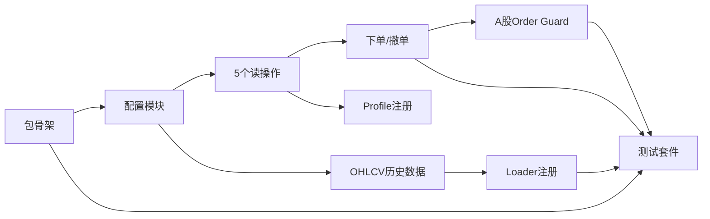

# miniqmt/xtquant 实盘集成方案

> 功能特性文档 | 版本：v3 | 更新日期：2026-07-07
> 分析人：Main Agent (Claude Opus 4.6) | 调度：Dispatcher

---

## 目录

1. [背景与概述](#1-背景与概述)
2. [集成模式选择](#2-集成模式选择)
3. [文件清单](#3-文件清单)
4. [关键设计决策](#4-关键设计决策)
5. [与现有层级的集成点](#5-与现有层级的集成点)
6. [限制与风险](#6-限制与风险)
7. [实施步骤](#7-实施步骤)
8. [附录：miniqmt/xtquant API 速查](#8-附录miniqmtxtquant-api-速查)
9. [问题分析与修复方案](#9-问题分析与修复方案)
    - [9.1 连接生命周期管理](#91-连接生命周期管理)
    - [9.2 Paper 模拟真实性问题](#92-paper-模拟真实性问题)
    - [9.3 安全链缺口](#93-安全链缺口)
    - [9.4 跨平台兼容问题](#94-跨平台兼容问题)
    - [9.5 数据层集成问题](#95-数据层集成问题)
    - [9.6 监控与可观测性](#96-监控与可观测性)
    - [9.7 配置管理与用户体验](#97-配置管理与用户体验)
    - [9.8 API 兼容性与版本管理](#98-api-兼容性与版本管理)
    - [9.9 问题修复优先级排序](#99-问题修复优先级排序)

---

## 1. 背景与概述

### 1.1 什么是 miniqmt/xtquant

**miniqmt**（也称 miniQMT）是迅投 QMT（Quantitative Market Trading）量化交易终端的轻量版本。它去掉了 QMT 内置的策略编辑器和 GUI，保留核心交易和行情功能，以**本地进程**形式运行。

**xtquant** 是 miniqmt 的官方 Python SDK，通过本地 IPC 与 miniqmt 进程通信，实现行情获取和实盘交易。

| 特性 | 说明 |
|---|---|
| 平台 | **仅 Windows**（QMT/miniqmt 无 macOS/Linux 版本） |
| 架构 | 本地进程 + Python SDK IPC |
| 市场 | A 股（沪深北交易所） |
| 交易能力 | 股票、基金、转债、ETF、期权 |
| 行情数据 | 本地缓存，支持离线使用 |
| 账户 | 通过券商开通 QMT 权限后使用 |

### 1.2 Vibe-Trading 集成目标

将 miniqmt/xtquant 作为 **第 11 个 Broker Connector** 接入 Vibe-Trading 交易安全层，实现以下能力：

- **A 股实盘交易**：通过 xtquant SDK 下单/撤单
- **A 股行情数据**：通过 xtdata 获取 K 线、实时行情
- **Shadow Account 模拟**：Paper 模式通过 Shadow Account 模拟撮合
- **Loader Registry 集成**：xtdata 作为 A 股数据源接入回测引擎

### 1.3 与现有连接器的关系

```
ibkr (local_tws)
robinhood (remote_mcp)
tiger (broker_sdk)
longbridge (broker_sdk, readonly)
alpaca (broker_sdk)
okx (broker_sdk)
binance (broker_sdk)
futu (broker_sdk)       ← 最接近的类比（本地 gateway + SDK IPC）
dhan (broker_sdk)
shoonya (broker_sdk)
trading212 (broker_sdk, readonly)
xtquant (broker_sdk)    ← 新增：与 Futu 架构同构
```

---

## 2. 集成模式选择

### 2.1 候选方案对比

| 方案 | 描述 | 优点 | 缺点 | 评价 |
|---|---|---|---|---|
| **Option A: `broker_sdk`** | 直接 `import xtquant`，与 Futu OpenD 模式一致 | 最小侵入，复用现有分发逻辑 | 仅限 Windows | ✅ **推荐** |
| Option B: `local_tws` | 类 IBKR 模式，通过 Socket IPC | — | xtquant SDK 已是最底层接口 | ❌ 不适用 |
| Option C: Docker+Wine | miniqmt 跑在 Wine，MCP/REST 暴露 | 跨平台 | 极高复杂度、Wine 兼容性差、延迟高 | ❌ 远期探索 |

### 2.2 推荐方案：Option A — `broker_sdk`

**核心理由：架构同构性**

xtquant 的架构（本地进程 + Python SDK IPC）与 **Futu OpenD + `futu-api`** 完全同构：

```
Futu:      Futu OpenD (Windows 进程) ← local socket → futu-api (Python SDK)
miniqmt:   miniqmt (Windows 进程)   ← local IPC    → xtquant (Python SDK)
```

Futu 连接器已在 `broker_sdk` transport 下稳定运行，xtquant 应遵循完全相同的模式：

1. **无需新增 transport 类型**：现有 `service.py` 的 `broker_sdk` 分支完全覆盖
2. **延迟导入处理 Windows-only**：与 `futu-api` 的可选依赖模式一致
3. **测试策略一致**：全 mock，不依赖真实 SDK

---

## 3. 文件清单

### 3.1 新增文件

| 文件路径 | 职责 | 预估行数 |
|---|---|---|
| `agent/src/trading/connectors/xtquant/__init__.py` | 包初始化 | ~5 |
| `agent/src/trading/connectors/xtquant/sdk.py` | SDK connector 实现（7 读 + 2 写函数） | ~400 |
| `agent/src/trading/connectors/xtquant/profiles.py` | TradingProfile 定义（4 个 profile） | ~60 |
| `agent/src/trading/connectors/xtquant/classification.py` | A 股代码分类（SH/SZ → CN_EQUITY） | ~30 |
| `agent/backtest/loaders/xtdata_loader.py` | xtdata 行情数据 Loader | ~100 |
| `agent/tests/test_xtquant_connector.py` | connector 单元测试（全 mock） | ~300 |
| `agent/tests/test_xtdata_loader.py` | loader 单元测试（全 mock） | ~100 |

### 3.2 修改文件

| 文件路径 | 修改内容 | 风险 |
|---|---|---|
| `agent/src/trading/profiles.py` | 导入 `XTQUANT_PROFILES`，加入 `BUILTIN_PROFILES` | 低 |
| `agent/src/trading/service.py` | `_SDK_CONNECTOR_MODULES` 添加 xtquant 条目 | 低 |
| `agent/src/trading/service.py` | `_CONNECTOR_INSTRUMENT` 添加 `"xtquant": ("equity", "cn_equity")` | 低 |
| `agent/backtest/loaders/registry.py` | `VALID_SOURCES` 和 `_loader_modules` 添加 xtdata | 低 |

---

## 4. 关键设计决策

### 4.1 Paper/Live 模式区分

#### 问题

miniqmt **本身无 paper 环境**——它直接连接实盘账户。这与 Futu（有 `trd_env=SIMULATE`）和 Alpaca（有 paper API host）不同。

#### 方案：4 个 Profile + Shadow Account 模拟

| Profile ID | 环境 | 只读 | 写操作路由 |
|---|---|---|---|
| `xtquant-paper` | paper | ✅ 只读 | 读走 xtquant，写不可用 |
| `xtquant-paper-trade` | paper | ❌ 可写 | 读走 xtquant，写走 Shadow Account 模拟撮合 |
| `xtquant-live-readonly` | live | ✅ 只读 | 读走 xtquant |
| `xtquant-live-trade` | live | ❌ 可写 | 经 Mandate Gate → Kill Switch → Audit → xtquant |

**核心原则**：
- Paper profile 的 `place_order`/`cancel_order` **绝不调用 xtquant SDK**
- Paper 写操作路由到 `agent/src/shadow_account/` 进行内存模拟撮合
- Live profile 的写操作必须经过完整的交易安全链
- Profile 默认只读，用户必须**显式选择** `xtquant-live-trade` 才能实盘下单

### 4.2 连接管理策略

#### XtQuantTrader 生命周期

```python
# 连接建立（3 步）
xt_trader = XtQuantTrader(mini_qmt_path, session_id)  # 1. 创建实例
xt_trader.start()        # 2. 启动后台线程
xt_trader.connect()      # 3. 连接 miniqmt 进程

# 账户订阅
acc = StockAccount(account_id, 'STOCK')
xt_trader.subscribe(acc) # 订阅账户 → 才能查询/交易
```

#### 策略：模块级单例 + 延迟初始化

```
sdk.py 内维护 _trader_instance: XtQuantTrader | None
├── 首次调用读/写操作时 lazy 初始化
├── connect 前做 TCP 端口探测（与 Futu connector 一致）
├── 每次操作前检查连接状态，断线自动重连（最多 1 次）
├── session_id 使用 "vibe-trading-{pid}" 避免多进程冲突
└── 提供 disconnect() 用于清理
```

#### 配置模型

```python
@dataclass(frozen=True)
class XtQuantConfig:
    mini_qmt_path: str          # miniqmt 安装路径（必需）
    account_id: str             # 资金账号（必需）
    account_type: str = "STOCK"
    profile: str = "paper"      # paper / live-readonly / live
    session_id: str = ""        # 空则自动生成
    timeout: float = 10.0       # 连接超时秒数
    readonly: bool = True
```

配置文件存储路径：`~/.vibe-trading/xtquant.json`

### 4.3 数据缓存策略

xtdata 自身有完善的本地缓存机制，因此**不重复缓存到 `~/.vibe-trading/cache/`**。

#### Loader 流程

```python
# 1. 确保数据已下载（如本地无缓存则从服务器获取）
xtdata.download_history_data(stock_code, period, start_time, end_time)

# 2. 读取本地缓存（xtdata 管理缓存路径）
data = xtdata.get_local_data(
    fields=['open','high','low','close','volume','amount'],
    stock_codes=[stock_code],
    period='1d',
    start_time='20240101',
    end_time='20240630',
    count=-1,
    dividend_type='front',
    fill_data=True
)

# 3. 归一化为标准 OHLCV DataFrame
#    xtdata 返回格式 → 列名映射为 open/high/low/close/volume/amount
#    validate_ohlc() 清洗 NaN 和异常值
```

#### Loader Registry 集成

- 注册名：`"xtdata"`
- 适用市场：A 股（`.SH`/`.SZ`/`.BJ` 代码）
- Fallback chain 优先级：排在 `tushare`/`akshare` 之后（因需要本地 miniqmt 进程）
- `auto` 回退链中仅在 Windows 平台激活

### 4.4 安全性考量

xtquant 是**最高风险等级**的 connector——通过本地 IPC 直接控制实盘账户，无原生 paper 隔离。

#### 安全链适配

```
下单请求
  │
  ▼
┌─────────────────────────────────────────────┐
│ 1. Kill Switch                               │
│    ~/.vibe-trading/kill_switch/xtquant.halt   │
│    文件存在 → 拒绝所有操作                     │
└─────────────────────┬───────────────────────┘
                      │
                      ▼
┌─────────────────────────────────────────────┐
│ 2. Mandate Gate                              │
│    instrument_type = "equity"                 │
│    asset_class = "cn_equity"                  │
│    品种限制 / 单笔限额 / 日限额 / 杠杆检查     │
└─────────────────────┬───────────────────────┘
                      │
                      ▼
┌─────────────────────────────────────────────┐
│ 3. Order Guard（A 股特殊规则）                │
│    · 整手检查：数量 % 100 == 0               │
│    · T+1 检查：今日买入不可今日卖出           │
│    · 涨跌停价格检查                          │
│    · 价格精度 0.01 元                        │
│    · 代码格式验证 XXXXXX.SH/SZ              │
└─────────────────────┬───────────────────────┘
                      │
                      ▼
┌─────────────────────────────────────────────┐
│ 4. PreTrade Advisory（可选）                  │
│    外部风控接口评估                           │
└─────────────────────┬───────────────────────┘
                      │
                      ▼
┌─────────────────────────────────────────────┐
│ 5. Audit Ledger                               │
│    ~/.vibe-trading/audit/xtquant_audit.jsonl   │
│    只追加，记录完整决策链                      │
└─────────────────────┬───────────────────────┘
                      │
                      ▼
┌─────────────────────────────────────────────┐
│ 6. XtQuantTrader.order_stock()               │
│    → miniqmt 进程 → 券商 → 交易所            │
└─────────────────────────────────────────────┘
```

#### 额外安全措施

| 措施 | 说明 |
|---|---|
| **Profile 默认只读** | 四个 profile 中仅 `xtquant-live-trade` 可写，需用户显式选择 |
| **代码符号验证** | `XXXXXX.SH`/`XXXXXX.SZ` 格式校验，拒绝非法代码 |
| **连接前置检查** | 下单前 `connect()` 和 `subscribe()` 状态确认 |
| **重试限制** | 断线自动重连仅一次，失败直接报错 |
| **操作权限位** | `xtquant-live-trade` 需要 `orders.place.requires_mandate` capability |

---

## 5. 与现有层级的集成点

### 5.1 SDK Connector 接口映射

Vibe-Trading 统一 SDK connector 接口 → xtquant 实现映射：

| 统一接口 | xtquant 实现 | 备注 |
|---|---|---|
| `build_config(data, overrides)` → `XtQuantConfig` | 合并 `~/.vibe-trading/xtquant.json` + profile defaults + overrides | 与 Futu `FutuConfig.from_mapping()` 模式一致 |
| `check_status(config)` → `dict` | TCP 端口探测 → `connect()` 验证 → 返回状态 | |
| `get_account_snapshot(config)` → `dict` | `xt_trader.get_asset(acc)` → `{total_value, cash, buying_power, ...}` | |
| `get_positions(config)` → `dict` | `xt_trader.get_stock_positions(acc)` → `[{symbol, qty, avg_cost, market_value, ...}]` | |
| `get_open_orders(config, include_executions)` → `dict` | `xt_trader.get_order_stock_orders(acc)` + 可选 `get_order_stock_trades(acc)` | |
| `get_quote(symbol, config)` → `dict` | `xtdata.get_full_tick([symbol])` → `{symbol, last, bid, ask, volume, ...}` | |
| `get_historical_bars(symbol, config, period, limit)` → `dict` | `xtdata.download_history_data()` + `get_local_data()` → 标准 OHLCV | |
| `place_order(config, symbol, side, ...)` → `dict` | **Paper**: Shadow Account; **Live**: `xt_trader.order_stock()` | 🔴 高风险 |
| `cancel_order(config, order_id, symbol)` → `dict` | **Paper**: Shadow Account; **Live**: `xt_trader.cancel_order(acc, int(order_id))` | 🔴 高风险 |

#### Period 映射

| Vibe-Trading period | xtdata period |
|---|---|
| `1m` | `1m` |
| `5m` | `5m` |
| `15m` | `15m` |
| `1h` | `60m` |
| `1d` | `1d` |

#### 订单类型映射

| Vibe-Trading | xtconstant |
|---|---|
| `"market"` | `xtconstant.LATEST_PRICE` |
| `"limit"` | `xtconstant.FIX_PRICE` |
| `"buy"` | `xtconstant.STOCK_BUY` |
| `"sell"` | `xtconstant.STOCK_SELL` |

### 5.2 TradingProfile 定义

```python
# agent/src/trading/connectors/xtquant/profiles.py

XTQUANT_PROFILES: tuple[TradingProfile, ...] = (
    TradingProfile(
        id="xtquant-paper",
        connector="xtquant",
        label="miniQMT Paper · Shadow Account",
        environment="paper",
        transport="broker_sdk",
        capabilities=READ_CAPABILITIES,
        readonly=True,
        config={"profile": "paper"},
        notes="读操作走 xtquant SDK，写操作不可用。"
              "需要本地 miniqmt 进程运行。仅限 Windows。",
    ),
    TradingProfile(
        id="xtquant-paper-trade",
        connector="xtquant",
        label="miniQMT Paper · Shadow Trading",
        environment="paper",
        transport="broker_sdk",
        capabilities=READ_CAPABILITIES + ("orders.place",),
        readonly=False,
        config={"profile": "paper"},
        notes="Paper 下单通过 Shadow Account 模拟撮合，"
              "行情从 xtdata 获取。不触及实盘。",
    ),
    TradingProfile(
        id="xtquant-live-readonly",
        connector="xtquant",
        label="miniQMT Live · Read-Only",
        environment="live",
        transport="broker_sdk",
        capabilities=READ_CAPABILITIES,
        readonly=True,
        config={"profile": "live-readonly"},
        notes="只读实盘账户。需要本地 miniqmt 进程运行。",
    ),
    TradingProfile(
        id="xtquant-live-trade",
        connector="xtquant",
        label="miniQMT Live · Trading",
        environment="live",
        transport="broker_sdk",
        capabilities=READ_CAPABILITIES + ("orders.place", "orders.place.requires_mandate"),
        readonly=False,
        config={"profile": "live"},
        notes="实盘下单。所有订单经 Mandate Gate + Kill Switch + Audit。"
              "高风险操作，需用户明确授权。",
    ),
)
```

### 5.3 service.py 注册

需要在 `agent/src/trading/service.py` 中做两处修改：

```python
# 1. _SDK_CONNECTOR_MODULES 新增
_SDK_CONNECTOR_MODULES["xtquant"] = "src.trading.connectors.xtquant.sdk"

# 2. _CONNECTOR_INSTRUMENT 新增
_CONNECTOR_INSTRUMENT["xtquant"] = ("equity", "cn_equity"),
```

`_order_classification` 已有 `.SH`/`.SZ` → `CN_EQUITY` 的逻辑（对代码后缀做映射），xtquant 的 `XXXXXX.SH`/`XXXXXX.SZ` 格式完全一致，无需额外适配。

### 5.4 profiles.py 注册

```python
# agent/src/trading/profiles.py

from src.trading.connectors.xtquant.profiles import XTQUANT_PROFILES

BUILTIN_PROFILES: tuple[TradingProfile, ...] = (
    *IBKR_PROFILES,
    *ROBINHOOD_PROFILES,
    ...
    *XTQUANT_PROFILES,    # 新增
)
```

### 5.5 Loader Registry 集成

```python
# agent/backtest/loaders/xtdata_loader.py

@register
class XtDataLoader:
    name = "xtdata"

    def load(self, symbol, start_date, end_date, **kwargs) -> pd.DataFrame:
        # 1. download_history_data 确保本地有数据
        # 2. get_local_data 读取
        # 3. 归一化列名
        # 4. validate_ohlc 清洗
        ...
```

```python
# agent/backtest/loaders/registry.py
VALID_SOURCES = (
    "auto", "tushare", "akshare", "yfinance", "baostock",
    "tencent", "mootdx", "ccxt", "futu", "eastmoney",
    "sina", "stooq", "yahoo", "finnhub", "alphavantage",
    "tiingo", "fmp", "local", "okx", "xtdata",  # 新增
)
_loader_modules = {
    ...
    "xtdata": "agent.backtest.loaders.xtdata_loader",
}
```

### 5.6 依赖管理

```toml
# pyproject.toml — optional dependencies
[project.optional-dependencies]
xtquant = ["xtquant"]  # 仅 Windows，非 PyPI 包
```

xtquant **不在 PyPI 上**，需用户从迅投官方获取 wheel 文件或通过 QMT 安装目录获取。Connector 和 Loader 均采用**延迟导入 + 友好错误提示**：

```python
def _import_xtquant():
    try:
        import xtquant
        return xtquant
    except ImportError:
        raise XtQuantDependencyError(
            "xtquant is not installed.\n"
            "  Windows: 从 QMT 安装目录获取 xtquant 包，或运行: pip install xtquant\n"
            "  Other OS: miniQMT 仅支持 Windows 平台"
        )


def _check_platform():
    import platform
    if platform.system() != "Windows":
        raise XtQuantPlatformError(
            "xtquant/miniQMT requires Windows.\n"
            "  Run Vibe-Trading on the same Windows machine as miniQMT."
        )
```

---

## 6. 限制与风险

### 6.1 Windows-Only 限制

| 影响 | 应对方案 |
|---|---|
| **CI/CD 环境（Linux）无法运行 xtquant** | 测试全部使用 mock，不依赖 `import xtquant` |
| **Docker 部署无法使用** | Profile 始终注册，运行时 `check_status` 返回 `platform_unsupported` 错误 |
| **macOS/Linux 开发者无法本地测试** | Connector 延迟导入，非 Windows 平台给出清晰提示 |
| **远期探索** | Docker+Wine 容器或 RPC 代理模式可作为 v2 探索 |

### 6.2 进程间通信故障模式

| 故障场景 | 检测方式 | 处理 |
|---|---|---|
| miniqmt 进程未启动 | `connect()` 返回非零 | `check_status` 返回 `{"connected": false, "error": "miniqmt not running"}` |
| miniqmt 进程崩溃/重启 | 操作超时或异常 | 捕获异常 → 自动重连一次 → 失败返回错误 |
| session_id 冲突 | subscribe 失败 | 使用 `"vibe-{pid}-{timestamp}"` 生成唯一 session_id |
| 账户未在 QMT 登录 | subscribe 返回错误 | 清晰提示用户在 QMT/miniqmt 中登录 |
| miniqmt 路径配置错误 | XtQuantTrader 构造失败 | 验证路径存在且包含 miniqmt 可执行文件 |

### 6.3 A 股交易规则适配

Order Guard 层需要新增 A 股特殊规则校验：

| 规则 | 实现 | 边界情况 |
|---|---|---|
| **最小交易单位** | `quantity % 100 == 0` | 不足 1 手（100股）拒绝 |
| **T+1 结算** | 检查持仓买入日期 < 今日 | ETF 支持 T+0，需区分品种 |
| **涨跌停限制** | 检查下单价格在 [跌停价, 涨停价] 内 | 主板 ±10%，创业板/科创板 ±20%，ST ±5% |
| **价格精度** | `round(price, 2)` 验证 | A 股最小价格变动 0.01 元 |
| **代码格式** | 正则 `^\d{6}\.(SH\|SZ\|BJ)$` | 北交所 `.BJ` 需支持 |

### 6.4 交易安全链风险

| 风险 | 严重程度 | 说明 |
|---|---|---|
| **Paper 模式下误调用 xtquant SDK** | 🔴 致命 | Paper profile 的写操作必须 100% 路由到 Shadow Account |
| **Kill Switch 被绕过** | 🔴 致命 | 文件系统哨兵可被删除，无校验和或加密保护 |
| **多进程同时操作同一 miniqmt** | 🟡 重要 | 多个 Vibe-Trading 实例可能冲突，session_id 唯一性不足 |
| **断线重连导致重复下单** | 🟡 重要 | 下单后断线，重连后需确认订单状态避免重复 |

---

## 7. 实施步骤

### 7.1 步骤分解

| 步骤 | 内容 | 前置依赖 | 高风险 | 预估工时 | 验收标准 |
|---|---|---|---|---|---|
| **S1** | 创建 `connectors/xtquant/` 包骨架（`__init__.py`, `sdk.py`, `profiles.py`, `classification.py`） | 无 | 否 | 1h | 文件存在，可 import |
| **S2** | 实现 `XtQuantConfig` + `build_config` + `load_config` | S1 | 否 | 1h | 配置解析测试通过 |
| **S3** | 实现 5 个读操作（check_status, get_account_snapshot, get_positions, get_open_orders, get_quote） | S2 | 否 | 3h | mock 测试通过，返回格式与其他 connector 一致 |
| **S4** | 实现 `get_historical_bars`（调用 xtdata） | S2 | 否 | 1h | 返回标准 OHLCV dict |
| **S5** | 实现 `place_order` + `cancel_order`（含 paper→Shadow Account 路由） | S3 | **是** | 3h | paper 不触及 xtquant SDK；live 经安全链 |
| **S6** | 创建 `profiles.py`，注册到 `profiles.py` + `service.py` | S3 | 否 | 0.5h | `list_profiles()` 包含 xtquant profiles |
| **S7** | 实现 `xtdata_loader.py`，注册到 Loader Registry | S4 | 否 | 1h | `resolve_loader("xtdata")` 返回正确类 |
| **S8** | 编写完整测试套件（全 mock，不依赖 xtquant） | S1-S7 | 否 | 2h | pytest 全绿，覆盖率 ≥ 90% |
| **S9** | A 股 Order Guard 规则（整手、T+1、涨跌停） | S5 | **是** | 2h | 规则测试覆盖边界情况 |

### 7.2 依赖关系



### 7.3 高风险步骤说明

#### S5 — 下单/撤单实现 🔴

```python
def place_order(config, symbol, side, quantity, notional=None,
                order_type='market', limit_price=None,
                time_in_force='day', **kwargs):
    """Place an order via xtquant."""

    # 1. Paper → Shadow Account
    if config.profile in ('paper',):
        return _paper_place_order(config, symbol, side, quantity, ...)

    # 2. Live → 安全链（由 service.py 调用 execute_live_order）
    #    此函数只做 SDK 调用，安全链在调用方
    _ensure_connected(config)
    acc = StockAccount(config.account_id, config.account_type)
    direction = xtconstant.STOCK_BUY if side == 'buy' else xtconstant.STOCK_SELL
    price_type = xtconstant.FIX_PRICE if order_type == 'limit' else xtconstant.LATEST_PRICE

    order_id = xt_trader.order_stock(
        acc, symbol, xtconstant.STOCK,
        price_type, direction,
        xtconstant.ORDER_TYPE_NORMAL,
        int(quantity), float(limit_price or 0),
        xtconstant.QUOTE_TYPE_LIMIT,
        order_remark=f"vibe-{kwargs.get('session_id', '')}"
    )
    return {"status": "ok", "order_id": str(order_id)}
```

#### S9 — A 股 Order Guard 规则 🔴

```python
def validate_a_stock_order(symbol: str, quantity: int, price: float,
                           side: str, positions: list) -> list[str]:
    """Validate A-share specific order rules. Returns list of violations."""
    errors = []

    # 1. 数量必须是 100 的倍数
    if quantity % 100 != 0:
        errors.append(f"Quantity {quantity} must be multiple of 100 (1 lot)")

    # 2. T+1 检查（卖出时）
    if side == 'sell':
        pos = next((p for p in positions if p['symbol'] == symbol), None)
        if pos and pos.get('days_to_settle', 0) > 0:
            errors.append(f"T+1 restriction: {symbol} bought today cannot be sold")

    # 3. 涨跌停检查
    prev_close = ...  # 从前日收盘价获取
    limit = 0.10  # 主板 ±10%
    if symbol.endswith('.SH') and symbol.startswith('688'):  # 科创板
        limit = 0.20
    elif symbol.endswith('.SZ') and symbol.startswith('30'):  # 创业板
        limit = 0.20

    if price > prev_close * (1 + limit):
        errors.append(f"Price {price} exceeds upper limit {prev_close * (1 + limit):.2f}")
    if price < prev_close * (1 - limit):
        errors.append(f"Price {price} below lower limit {prev_close * (1 - limit):.2f}")

    # 4. 价格精度
    if round(price, 2) != price:
        errors.append(f"Price {price} exceeds A-share precision (0.01)")

    return errors
```

---

## 8. 附录：miniqmt/xtquant API 速查

### 8.1 核心模块

```python
from xtquant.xttrader import XtQuantTrader       # 交易接口
from xtquant.xtdata import *                       # 行情数据
from xtquant.xttype import StockAccount            # 账户类型
from xtquant import xtconstant                     # 常量
```

### 8.2 XtQuantTrader 交易接口

```python
# 创建与连接
xt_trader = XtQuantTrader(mini_qmt_path, session_id)
xt_trader.start()
result = xt_trader.connect()
acc = StockAccount(account_id, 'STOCK')
xt_trader.subscribe(acc)

# 下单
order_id = xt_trader.order_stock(
    account,          # StockAccount
    stock_code,       # "000001.SZ"
    order_system,     # xtconstant.STOCK
    price_type,       # xtconstant.FIX_PRICE / LATEST_PRICE
    order_direction,  # xtconstant.STOCK_BUY / STOCK_SELL
    order_type,       # xtconstant.ORDER_TYPE_NORMAL
    quantity,         # int, 必须为 100 的倍数
    price,            # float
    quote_type,       # xtconstant.QUOTE_TYPE_LIMIT
    order_remark=''
)

# 撤单
xt_trader.cancel_order(account, order_id)

# 查询
positions = xt_trader.get_stock_positions(account)
orders = xt_trader.get_order_stock_orders(account)
trades = xt_trader.get_order_stock_trades(account)
asset = xt_trader.get_asset(account)
```

### 8.3 xtdata 行情接口

```python
# 下载历史数据到本地缓存
xtdata.download_history_data(stock_code, period, start_time, end_time)

# 读取本地缓存
data = xtdata.get_local_data(
    fields=['open','high','low','close','volume','amount'],
    stock_codes=[stock_code],
    period='1d',
    start_time='20240101',
    end_time='20240630',
    count=-1,
    dividend_type='front',
    fill_data=True
)

# 实时行情
quote = xtdata.get_full_tick([stock_code])
```

### 8.4 常量速查

```python
xtconstant.STOCK_BUY          # 买入
xtconstant.STOCK_SELL         # 卖出
xtconstant.STOCK_STOCK_A      # A股
xtconstant.FIX_PRICE          # 限价
xtconstant.LATEST_PRICE       # 市价
xtconstant.QUOTE_TYPE_LIMIT   # 限价申报
xtconstant.QUOTE_TYPE_MARKET  # 市价申报
xtconstant.ORDER_TYPE_NORMAL  # 常规订单
xtconstant.ORDER_TYPE_GTC     # 长期有效订单
```

---

## 附录 A：文件变更总览

```
Vibe-Trading/
├── agent/
│   ├── src/
│   │   ├── trading/
│   │   │   ├── connectors/
│   │   │   │   └── xtquant/              ← 新增目录
│   │   │   │       ├── __init__.py
│   │   │   │       ├── sdk.py
│   │   │   │       ├── profiles.py
│   │   │   │       └── classification.py
│   │   │   ├── profiles.py               ← 修改
│   │   │   └── service.py                ← 修改
│   │   └── ...（其他模块不变）
│   ├── backtest/
│   │   └── loaders/
│   │       ├── xtdata_loader.py          ← 新增
│   │       └── registry.py               ← 修改
│   └── tests/
│       ├── test_xtquant_connector.py     ← 新增
│       └── test_xtdata_loader.py         ← 新增
├── doc/
│   └── features/
│       └── xtquant-integration.md        ← 本文档
└── pyproject.toml                        ← 修改（可选依赖）
```

---

## 9. 问题分析与修复方案

> 分析人：Main Agent (Claude Opus 4.6) | 分析日期：2026-07-07
> 基于对现有方案的深度审查，识别出 23 个问题（P0 致命 2 个、P1 重要 11 个、P2 建议 10 个），以下逐一分析并给出修复方案。

---

### 9.1 连接生命周期管理

#### 9.1.1 单例模式的竞态条件（线程不安全）

**问题描述**：`sdk.py` 中 `_ensure_connected()` 对全局变量 `_trader` / `_trader_config` 的读写没有加锁。当多个 Agent 工具并发调用时，可能出现：
- 两个线程同时判断 `_trader is None`，各自创建 `XtQuantTrader` 实例
- 一个线程正在 `_disconnect()` 清理旧连接，另一个线程已经在使用 `_trader`

**严重程度**：重要

**根因分析**：FastAPI 是多线程模型，Agent 工具可从不同 async task 并发调用。但 `_trader` 的创建/销毁/使用完全无锁。

**解决方案**：新增 `_trader_lock = threading.Lock()` 保护 `_trader` 生命周期：

```python
_trader_lock = threading.Lock()

def _ensure_connected(config: XtQuantConfig) -> Any:
    global _trader, _trader_config
    with _trader_lock:
        if _trader is not None and _trader_config is not None:
            if (_trader_config.mini_qmt_path == config.mini_qmt_path
                and _trader_config.session_id == config.session_id):
                return _trader
            _disconnect()
        # ... 创建新连接 ...
        _trader = trader
        _trader_config = config
        return _trader
```

**涉及文件**：`agent/src/trading/connectors/xtquant/sdk.py`

---

#### 9.1.2 连接泄漏 — `start()` 后无 `stop()` 保障

**问题描述**：`XtQuantTrader.start()` 启动后台线程。当前 `_disconnect()` 调用了 `trader.stop()`，但没有 `atexit` 注册。如果 FastAPI 进程被 `SIGKILL` 或异常退出，后台线程不会被清理。`start()` → `connect()` 之间如果抛异常，`stop()` 不会执行。

**严重程度**：建议

**解决方案**：

```python
import atexit

def _ensure_connected(config):
    # ... 创建 trader ...
    trader.start()
    try:
        connect_result = trader.connect()
        if connect_result != 0:
            raise XtQuantConnectionError(...)
    except Exception:
        trader.stop()
        raise
    _trader = trader
    atexit.register(_disconnect)  # 只注册一次
    return _trader
```

**涉及文件**：`agent/src/trading/connectors/xtquant/sdk.py`

---

#### 9.1.3 miniqmt 进程崩溃无法感知

**问题描述**：如果 miniqmt 进程崩溃（Windows 蓝屏、进程被杀），Python 端的 `_trader` 引用仍然存在。后续调用会得到不可预测的错误。

**严重程度**：重要

**解决方案**：为所有 trader 操作增加健康探测 + 单次重连包装器：

```python
def _with_reconnect(func, config, *args, **kwargs):
    try:
        return func(*args, **kwargs)
    except Exception as exc:
        if _is_connection_error(exc):
            logger.warning("xtquant connection error, attempting reconnect: %s", exc)
            _disconnect()
            _ensure_connected(config)
            return func(*args, **kwargs)  # 重试一次
        raise
```

**涉及文件**：`agent/src/trading/connectors/xtquant/sdk.py`

---

#### 9.1.4 Session 恢复缺失

**问题描述**：Vibe-Trading 重启后 `_trader` 为 `None`，需重新连接。设计上 fail-closed 是安全的，但缺少状态恢复提示。

**严重程度**：建议

**解决方案**：在 `check_status()` 中检测上次使用的 profile，如果上次是 live 模式，返回 `reconnect_hint` 字段提示用户需要重新激活。

**涉及文件**：`agent/src/trading/connectors/xtquant/sdk.py`

---

### 9.2 Paper 模拟真实性问题

#### 9.2.1 Paper `place_order` 未真正对接 Shadow Account

**问题描述**：⚠️ **致命问题**。当前 `_paper_place_order` 只是生成一个 `paper-{uuid}` 的 order_id 并返回 `{"status": "ok"}`——它**没有调用**任何模拟撮合逻辑。Paper 下单不会更新模拟持仓、不会模拟成交、也无法通过 `get_positions` 看到 paper 下的单。

**严重程度**：🔴 **致命**

**根因分析**：Shadow Account 模块的能力是「从 journal 提取 shadow profile」和「回测」，它本身不是一个内存撮合引擎。

**解决方案**：在 `sdk.py` 中维护一个内存级 Paper Account 状态：

```python
_paper_positions: dict[str, PaperPosition] = {}
_paper_orders: list[PaperOrder] = []
_paper_cash: float = 1_000_000.0  # 初始模拟资金

def _paper_place_order(...):
    # 1. 从 xtdata 获取当前价格
    # 2. 模拟成交（market 单立即成交，limit 单挂单）
    # 3. 更新 _paper_positions / _paper_cash
    # 4. 记录到 _paper_orders
```

推荐新增独立文件 `agent/src/trading/connectors/xtquant/paper_engine.py` 维护 Paper Account 状态机。

**涉及文件**：
- `agent/src/trading/connectors/xtquant/sdk.py` — 重构 `_paper_place_order`
- `agent/src/trading/connectors/xtquant/paper_engine.py` — **新增** Paper Account 状态管理

---

#### 9.2.2 Paper 模式的读操作仍走 xtquant SDK

**问题描述**：Paper profile 的 `get_positions`、`get_account_snapshot` 仍然调用 xtquant SDK 读取**真实账户**数据。Paper 模式暴露了实盘持仓和资金信息，且 paper 下单后 `get_positions` 不会显示刚下的 paper 订单。

**严重程度**：重要

**解决方案**：Paper profile 的读操作应返回模拟账户数据（来自 Paper Engine）。`get_quote` 和 `get_historical_bars` 可保留走 xtquant SDK。

**涉及文件**：`agent/src/trading/connectors/xtquant/sdk.py`

---

#### 9.2.3 条件单在 Paper 模式无法工作

**问题描述**：Paper Engine 无法处理止损、止盈等条件单。limit 单也没有价格监听和触发成交的机制。

**严重程度**：建议

**解决方案**：短期——Paper 模式 limit 单以当前 xtdata 行情价格立即判断能否成交，不能成交则标记为 `pending`；不支持条件单则返回明确错误。长期——引入后台线程定期检查 pending 订单。

**涉及文件**：`agent/src/trading/connectors/xtquant/paper_engine.py`（新增）

---

### 9.3 安全链缺口

#### 9.3.1 Profile override 可绕过 paper/live 隔离

**问题描述**：`build_config` 的 `_OVERRIDE_KEYS` 包含 `"profile"`。调用者可以通过 overrides 覆盖 profile 值。攻击者可构造 `profile="paper"` 但 `mini_qmt_path` 指向真实环境的 config，在 paper TradingProfile 下获得 live config。

**严重程度**：重要

**解决方案**：
1. 从 `_OVERRIDE_KEYS` 中移除 `"profile"`，禁止通过 overrides 修改 profile
2. 在 `service.py` 的 paper 路径中增加断言：`assert config.profile == "paper"`
3. 在 `place_order` 的 paper 分支中增加防御性检查

**涉及文件**：
- `agent/src/trading/connectors/xtquant/sdk.py`（`_OVERRIDE_KEYS`）
- `agent/src/trading/service.py`（paper 路径校验）

---

#### 9.3.2 Kill Switch 无第二层防护

**问题描述**：Kill Switch 依赖 `~/.vibe-trading/kill_switch/xtquant.halt` 文件存在。用户（或恶意程序）删除该文件后 Kill Switch 立即失效。

**严重程度**：重要

**解决方案**：增加内存级 Kill Switch 作为第二层防护：

```python
_memory_halt: dict[str, bool] = {}

def halt_broker(broker: str):
    _memory_halt[broker] = True
    halt_flag_path(broker).touch()

def is_halted(broker: str) -> bool:
    return _memory_halt.get(broker, False) or halt_flag_set(broker)
```

**涉及文件**：`agent/src/live/halt.py`、`agent/src/live/sdk_order_gate.py`

---

#### 9.3.3 MCP Server 权限控制

**问题描述**：MCP Server 暴露的工具如果包含 `place_order`，外部 AI 客户端可直接调用。MCP 协议无内置 ACL 机制。

**严重程度**：重要

**解决方案**：
1. MCP Server 默认不暴露 `place_order` / `cancel_order` 工具
2. 需通过环境变量 `VIBE_MCP_ENABLE_TRADING=true` 显式启用
3. 即使启用，仍必须经过完整安全链

**涉及文件**：`agent/mcp_server.py`

---

#### 9.3.4 T+1 规则完全未实现

**问题描述**：⚠️ **致命问题**。文档中声明了 "T+1 检查：今日买入不可今日卖出"，但 `a_stock_guard.py` 中 T+1 规则**完全未实现**。这需要维护每只股票的买入日期缓存。

**严重程度**：🔴 **致命**

**根因分析**：T+1 规则需要跨请求状态（持仓买入日期），但当前 Order Guard 是无状态的纯函数。

**解决方案**：

```python
def check_t_plus_1(symbol: str, side: str, connector_module, config) -> str | None:
    if side != "sell":
        return None
    # 查询 xtquant 当日委托记录
    orders = connector_module.get_open_orders(config, include_executions=True)
    today = datetime.now().strftime("%Y%m%d")
    for exec in orders.get("executions", []):
        if exec["symbol"] == symbol and exec["side"] == "buy" and exec["time"].startswith(today):
            return f"T+1 violation: {symbol} was bought today, cannot sell until tomorrow"
    return None
```

需注意 ETF（如 510050.SH）支持 T+0，需在品种判断中区分。

**涉及文件**：
- `agent/src/live/a_stock_guard.py`
- `agent/src/live/sdk_order_gate.py`

---

### 9.4 跨平台兼容问题

#### 9.4.1 `service.py` 注册指向 `sdk_http` 非 `sdk`

**问题描述**：`_SDK_CONNECTOR_MODULES["xtquant"]` 当前指向 `"src.trading.connectors.xtquant.sdk_http"`，不是 `sdk.py`。Windows 用户也会被迫使用 HTTP Bridge 而非直连。

**严重程度**：重要

**解决方案**：应根据运行平台动态选择：

```python
import platform
_SDK_CONNECTOR_MODULES["xtquant"] = (
    "src.trading.connectors.xtquant.sdk"
    if platform.system() == "Windows"
    else "src.trading.connectors.xtquant.sdk_http"
)
```

**涉及文件**：`agent/src/trading/service.py`

---

#### 9.4.2 `sdk_http.py` 缺少 `place_order` / `cancel_order`

**问题描述**：`sdk_http.py` 的 `__all__` 不包含 `place_order` 和 `cancel_order`。HTTP 模式下调用 `module.place_order` 会 `AttributeError`。

**严重程度**：重要

**解决方案**：在 `sdk_http.py` 中实现 `place_order` / `cancel_order`，通过 HTTP POST 转发到 QMT Bridge 的下单端点。或在 `service.py` 中对 HTTP transport 禁止写操作。

**涉及文件**：`agent/src/trading/connectors/xtquant/sdk_http.py`

---

#### 9.4.3 xtquant 安装依赖非 PyPI 包

**问题描述**：`pyproject.toml` 中声明 `xtquant = ["xtquant"]` 作为可选依赖，但 xtquant **不在 PyPI 上**。用户 `pip install vibe-trading-ai[xtquant]` 会失败。

**严重程度**：重要

**解决方案**：
1. `pyproject.toml` 中移除 `xtquant` 可选依赖（因不可 pip install）
2. 在文档和错误提示中说明安装方式：从 QMT 安装目录复制或 `pip install /path/to/xtquant-xxx.whl`
3. 保持 `_import_xtquant()` 的友好错误信息

**涉及文件**：`pyproject.toml`

---

### 9.5 数据层集成问题

#### 9.5.1 Loader Fallback 链数据不一致

**问题描述**：同只 A 股代码，tushare/akshare/xtdata 可能返回不同的 OHLCV 数据（复权方式不同、时间戳差异）。`auto` 模式回退时，不同 Loader 数据导致回测结果不可比较。

**严重程度**：建议

**解决方案**：
1. 在 Loader Registry 中标准化复权方式参数
2. xtdata Loader 的 `load()` 方法接受 `adjust` 参数并映射到 `dividend_type`
3. 在回测报告中记录实际使用的 Loader 和复权方式

**涉及文件**：`agent/backtest/loaders/xtdata_loader.py`

---

#### 9.5.2 全局锁导致并发回测瓶颈

**问题描述**：`_xtdata_lock` 是全局锁，`download_history_data` 是阻塞同步调用。多标的回测场景下所有操作串行执行。300 只股票每只下载 2 秒需 10 分钟。

**严重程度**：重要

**解决方案**：
1. **批量下载**：xtdata 支持批量 `download_history_data` 多只股票
2. **细化锁粒度**：将 download 和 read 分离
3. **预下载缓存预热**：回测开始前一次性下载所有标的

```python
def prefetch_batch(symbols: list[str], period: str, start: str, end: str):
    with _xtdata_lock:
        for sym in symbols:
            xtdata.download_history_data(sym, period, start, end)
```

**涉及文件**：`agent/backtest/loaders/xtdata_loader.py`

---

#### 9.5.3 xtdata 本地缓存管理缺失

**问题描述**：xtdata 的本地缓存可能膨胀到数 GB。用户没有从 Vibe-Trading 侧管理缓存的手段。

**严重程度**：建议

**解决方案**：提供 CLI 命令：
```bash
vibe-trading cache info --source xtdata    # 显示缓存路径和大小
vibe-trading cache clear --source xtdata   # 清除缓存
```

**涉及文件**：`agent/cli/commands/` 下新增缓存管理命令

---

### 9.6 监控与可观测性

#### 9.6.1 连接健康检测无定时心跳

**问题描述**：`check_status()` 被动调用，无后台心跳线程。连接断开后用户只有在下一次操作时才会发现。

**严重程度**：建议

**解决方案**：在 `api_server.py` 的心跳端点中加入 xtquant 连接检查。

**涉及文件**：`agent/api_server.py`

---

#### 9.6.2 审计日志未区分 paper/live 操作来源

**问题描述**：Paper 操作只做了 `logger.info`，未写入审计日志。审计记录中也没有 `environment` 字段区分 paper/live。

**严重程度**：建议

**解决方案**：在审计记录中增加 `environment` 字段。

**涉及文件**：`agent/src/live/sdk_order_gate.py`、`agent/src/trading/connectors/xtquant/sdk.py`

---

### 9.7 配置管理与用户体验

#### 9.7.1 多账号支持缺失

**问题描述**：`XtQuantConfig` 只支持单个 `account_id`。用户有多个 QMT 账号时无法方便切换。

**严重程度**：建议

**解决方案**：在 `xtquant.json` 中支持 `accounts` 数组，通过 `--account` CLI 参数切换。

**涉及文件**：`agent/src/trading/connectors/xtquant/sdk.py`

---

#### 9.7.2 首次设置引导流程缺失

**问题描述**：用户首次使用 xtquant 时需手动创建配置文件，无交互式引导。

**严重程度**：建议

**解决方案**：在 `vibe-trading setup` 中增加交互式引导：
1. 自动扫描常见 QMT 安装路径
2. 引导确认路径
3. 自动发现账号

**涉及文件**：`agent/cli/onboard.py`

---

### 9.8 API 兼容性与版本管理

#### 9.8.1 xtquant 属性名硬编码无版本检查

**问题描述**：`sdk.py` 中大量使用 `_attr(obj, "total_asset")` 等硬编码属性名。xtquant 版本升级可能改变属性名。

**严重程度**：建议

**解决方案**：在 `check_status` 中检测 xtquant 版本，定义已测试版本范围，对未知版本输出警告。

**涉及文件**：`agent/src/trading/connectors/xtquant/sdk.py`

---

#### 9.8.2 `order_stock` 参数组合未验证

**问题描述**：`order_stock` 调用中常量组合是否正确未经验证。不同 xtquant 版本的参数签名可能不同。

**严重程度**：重要

**解决方案**：添加 `_validate_order_params` 函数在调用前验证参数组合。用 try-except 捕获 `order_stock` 异常并输出友好错误信息。

**涉及文件**：`agent/src/trading/connectors/xtquant/sdk.py`

---

### 9.9 问题修复优先级排序

| 优先级 | 问题 | 严重程度 | 影响范围 | 修复难度 |
|---|---|---|---|---|
| **P0** | 9.2.1 Paper `place_order` 未对接 Shadow Account | 🔴 致命 | Paper 模式功能完全失效 | 高 |
| **P0** | 9.3.4 T+1 规则完全未实现 | 🔴 致命 | A 股卖出无 T+1 保护 | 中 |
| **P1** | 9.3.1 Profile override 可绕过 paper/live 隔离 | 重要 | 安全边界 | 低 |
| **P1** | 9.4.1 `service.py` 注册指向 `sdk_http` 非 `sdk` | 重要 | Windows 直连不可用 | 低 |
| **P1** | 9.4.2 `sdk_http.py` 缺少 `place_order`/`cancel_order` | 重要 | HTTP 模式下单不可用 | 中 |
| **P1** | 9.1.1 `_ensure_connected` 线程不安全 | 重要 | 并发崩溃风险 | 低 |
| **P1** | 9.1.3 miniqmt 崩溃无法感知 + 无重连 | 重要 | 连接可靠性 | 中 |
| **P1** | 9.2.2 Paper 读操作暴露实盘数据 | 重要 | Paper/Live 隔离不完整 | 中 |
| **P1** | 9.3.2 Kill Switch 无第二层防护 | 重要 | 安全兜底 | 低 |
| **P1** | 9.3.3 MCP Server 权限控制 | 重要 | 外部攻击面 | 低 |
| **P1** | 9.4.3 xtquant 非 PyPI 依赖 | 重要 | 安装失败 | 低 |
| **P1** | 9.5.2 全局锁导致并发回测瓶颈 | 重要 | 性能 | 中 |
| **P1** | 9.8.2 `order_stock` 参数组合未验证 | 重要 | 下单可靠性 | 低 |
| **P2** | 9.1.2 连接泄漏无 atexit | 建议 | 资源泄漏 | 低 |
| **P2** | 9.1.4 Session 恢复无提示 | 建议 | 用户体验 | 低 |
| **P2** | 9.2.3 条件单不支持 | 建议 | 功能完整性 | 高 |
| **P2** | 9.5.1 Loader 复权方式不一致 | 建议 | 数据一致性 | 中 |
| **P2** | 9.5.3 缓存管理缺失 | 建议 | 用户体验 | 低 |
| **P2** | 9.6.1 无定时心跳 | 建议 | 可观测性 | 低 |
| **P2** | 9.6.2 审计日志无 environment 字段 | 建议 | 合规 | 低 |
| **P2** | 9.7.1 多账号支持 | 建议 | 功能完整性 | 中 |
| **P2** | 9.7.2 首次设置引导 | 建议 | 用户体验 | 中 |
| **P2** | 9.8.1 属性名无版本检查 | 建议 | 兼容性 | 低 |

#### 建议修复路线

```
阶段 1 — 立即修复 P0（2 个致命问题）
├── Paper Engine 实现（_paper_place_order + paper_engine.py）
└── T+1 规则实现（a_stock_guard.py）

阶段 2 — 安全修复 P1（前 5 个）
├── Profile 隔离加固（移除 profile override）
├── service.py 注册修正（动态选择 sdk/sdk_http）
├── sdk_http 补全 place_order/cancel_order
├── 线程安全（加 _trader_lock）
└── 重连机制（_with_reconnect 包装器）

阶段 3 — 基础设施 P1（后 4 个）
├── Kill Switch 双层防护（内存 + 文件）
├── MCP 权限控制（VIBE_MCP_ENABLE_TRADING）
├── 依赖管理（pyproject.toml 修正）
└── 回测性能优化（批量预下载）

阶段 4 — P2 逐步迭代
├── atexit 注册 / Session 提示
├── 缓存管理 CLI
├── 多账号支持
├── 首次设置引导
├── 版本兼容检查
└── 条件单支持（远期）
```

> 📎 **未修复问题追踪**：[TODO-xtquant.md](TODO-xtquant.md) — 当前剩余 5 项未修复（P0×1, P1×3, P2×1）

---

*本文档由 Vibe-Trading Dispatcher 调度生成，架构分析由 Main Agent (Claude Opus 4.6) 提供。*
